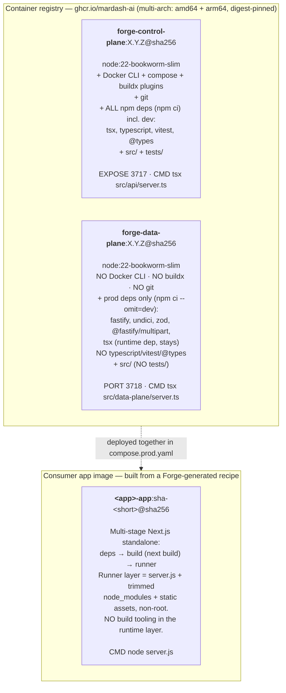
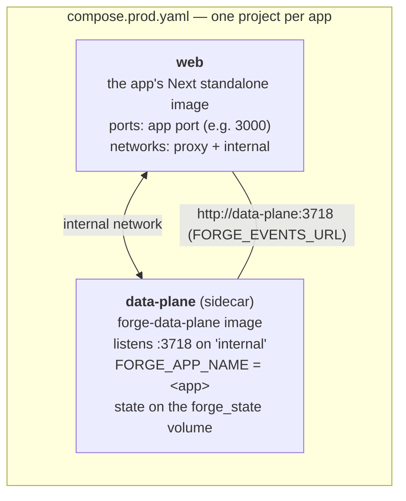

# 1 · Container strategy

Forge is built and shipped as **three** distinct images with strict, non-overlapping contents. Two are
platform images Forge publishes; the third is the consumer app's own runtime image, which Forge
*generates the recipe for* but which contains only the app.

## The three images

### Control-plane image — `forge-control-plane`

The **developer / orchestration runtime**. It is deliberately heavy: it carries the Docker CLI + Compose
+ Buildx plugins and `git` so capabilities can drive `docker compose` and image builds against the host
daemon (**Docker-out-of-Docker**), and it installs the *full* dependency tree (`npm ci`, including the
dev toolchain `tsx`/`tsc`/`vitest`) because it builds, tests, and lints app code. It runs the HTTP API on
**:3717**, is **multi-app** (many apps under one workspace), and holds the encrypted C5 secrets vault an
operator writes to with `forge secrets set`. It is the only place a build, a `forge` command, or a deploy
runs — it is **never** part of a production app stack.

> The image installs from the committed lockfile (`npm ci`) on purpose, so the built image's dependency
> tree is byte-identical to what source + CI test — a rebuild can't silently drift onto a newer, broken
> transitive version.

### Data-plane image — `forge-data-plane`

The **production / runtime sidecar**. It is the slim counterpart: `npm ci --omit=dev` drops
`typescript`, `vitest`, and `@types/*`; there is **no Docker CLI**, **no build/test/lint toolchain**, and
`tests/` is not copied. It runs the data-plane HTTP server on **:3718**, is **single-app** (bound to one
`FORGE_APP_NAME`), and serves only the capabilities whose `plane` is `data` or `both`. Its HTTP handler
explicitly **404s** any capability whose plane is `control` — the split is enforced at the request
boundary, not just by what's installed.

### Consumer-app image — generated, not shipped by Forge

`forge productionize` emits a multi-stage **Next.js standalone** `Dockerfile` (`deps → build → runner`).
The final `runner` stage copies only Next's `output: 'standalone'` server, its trimmed `node_modules`,
and static assets, runs as a **non-root** user, and carries **no build tooling**. The app image and the
data-plane image are versioned independently and pinned by digest in `compose.prod.yaml`.

## Why dev/build dependencies never reach production

Three independent guarantees, layered:

1. **Separate Dockerfiles.** `Dockerfile` (control plane) and `Dockerfile.data-plane` are distinct
   builds. The data-plane build omits dev deps and never installs the Docker CLI or git.
2. **A slim app image.** The app ships from Next standalone output — the `build` stage's tooling stays in
   an intermediate layer that is discarded; only the `runner` layer ships.
3. **A build-image smoke gate in CI.** Source-level unit tests can't catch a defect that lives only in a
   built image (a dropped runtime dep, an un-copied file). A dedicated CI job builds *both* platform
   images the way they actually ship and probes each container's in-container `/health` for HTTP 200 — so
   "the image doesn't serve" fails a check, not a production host.

## The production sidecar model

In production the app is **not** deployed alone. `forge productionize` generates a `compose.prod.yaml`
that runs the app's `web` container **beside** a `data-plane` sidecar container in the same Compose
project, on a private `internal` bridge network:

- The app reaches the sidecar at a stable in-cluster DNS name: **`http://data-plane:3718`**, injected as
  `FORGE_EVENTS_URL` (and the alias `FORGE_DATA_PLANE_URL`).
- The sidecar reaches back into the app over the same `internal` network at **`http://web:<port>`**
  (injected as `FORGE_APP_CALLBACK_HOST=web` + `FORGE_APP_CALLBACK_PORT`) — used by the scheduler's cron
  callbacks and the status page's live health probe.
- The sidecar is **single-app**: it defaults every route to its own `FORGE_APP_NAME`, so the app rarely
  passes an app id. One sidecar serves one app; scaling out means one sidecar per app stack.
- The sidecar's **entire state directory** (`FORGE_STATE_DIR=/forge-state`) rides one durable named volume
  (`forge_state`). This is load-bearing: users/sessions, the secrets vault, the app-event log,
  notifications, the search index, and blob bytes all live there, so a redeploy that recreates the sidecar
  container **keeps** signed-in users and stored data. (See [Runtime topology](02-runtime-topology.md).)

Packaging choice, stated plainly: the data plane is a **per-app sidecar container**, not a shared
service and not an embedded library. That keeps a single-app trust boundary (the sidecar trusts its one
app), keeps the slim image free of the app's dependencies, and lets the app and platform version and roll
independently.
