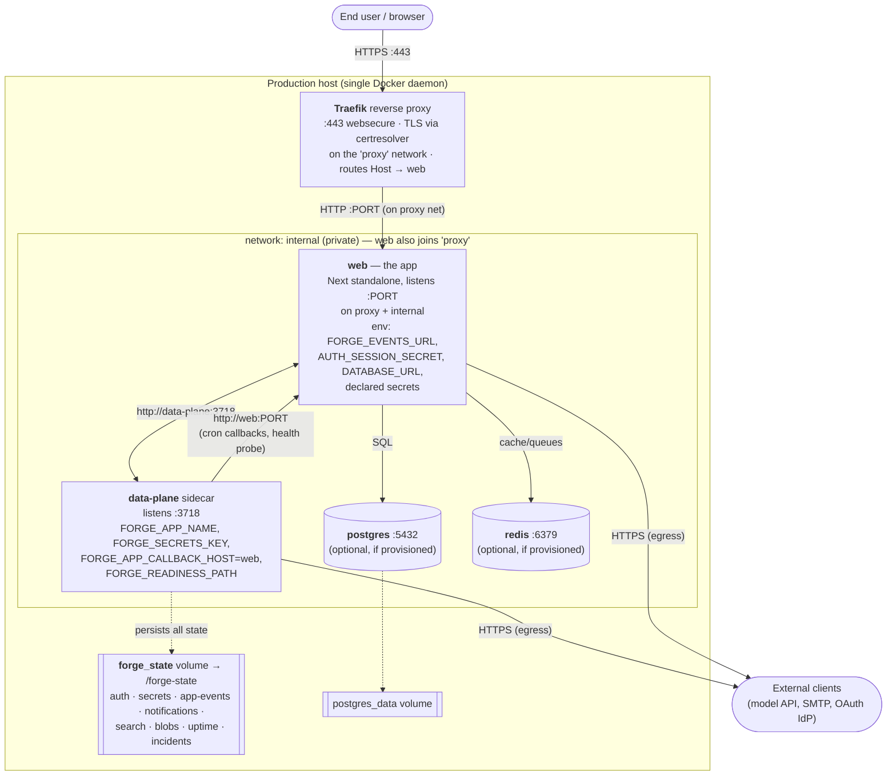

# 2 · Runtime topology

This is the deployed system: the containers, the networks they sit on, the datastores, the durable
volumes, external ingress/TLS, and what the control plane does during a deploy.

## Production topology



### Components

| Component | Image | Network(s) | Port | Notes |
|---|---|---|---|---|
| **Traefik** | operator-run reverse proxy | `proxy` (external) | 443 | Terminates TLS (cert resolver), routes by `Host()` rule, health-checks the web backend on the app's readiness path. Not generated by Forge — the operator runs it once; Forge emits the router/service **labels** the app needs. |
| **web** | `<app>-app@sha256` (generated) | `proxy` + `internal` | app port (e.g. 3000) | The Next standalone app. Only container on the public `proxy` network. |
| **data-plane** | `forge-data-plane@sha256` | `internal` only | 3718 | The sidecar. Never publicly exposed; reached only by `web` over `internal`. |
| **postgres** | `postgres:16-alpine` | `internal` | 5432 | Present only if the app was provisioned with a DB. `DATABASE_URL` built from `POSTGRES_PASSWORD`. |
| **redis** | `redis:7-alpine` | `internal` | 6379 | Present only if provisioned. `REDIS_URL=redis://redis:6379`. |

### Networks

- **`proxy`** — an **external** (operator-created) network shared with Traefik. Only `web` joins it. This
  is the sole public ingress path; a start-first deploy drains the old `web` replica *out of this network*
  before removing it, so there is never a zero-backend window.
- **`internal`** — a private bridge network for `web ⇄ data-plane ⇄ postgres/redis`. The sidecar and
  datastores are **never** reachable from outside the host.

### Durable state

- **`forge_state`** (named volume, mounted at `/forge-state` in the sidecar) holds the sidecar's entire
  state directory as plain files:

  ```text
  /forge-state
    auth/<appId>.json            users, sessions, refresh tokens, verify/reset tokens  (C10/C11)
    secrets/vault-<appId>.json   AES-256-GCM sealed secrets                             (C5)
    app-events/<appId>.jsonl     append-only domain event log                          (C3)
    notifications/<appId>.json   keyed, upsert/dismiss/clear                            (C4)
    search/<appId>.json          document map, BM25 recomputed per query (NOT an       (C19)
                                  engine — see 07-data-storage.md §2)
    blobs/<appId>.json           blob metadata   +   blobs/bytes/<appId>/<blobId>       (C20)
    uptime/<appId>.{jsonl,rollup.json}   health snapshots + per-day rollups             (C15)
    incidents/<appId>.json       operator-declared incidents                           (C15)
    resources/<Type>/<id>.json   Resource store: C1/C2/C7/C12/C14 + core (one file/id)
    events/events.jsonl          append-only platform fact log
  ```

  **This is a summary — the rigorous, code-verified per-capability layout (format, write model, and
  concurrency-safety of each store) is [07 · Data storage](07-data-storage.md).** Keeping this on a
  **named** volume is what lets a signed-in user and stored data **survive a redeploy**: `forge deploy`
  recreates the sidecar container onto the new pinned image, and a named volume persists across that
  recreate. An ephemeral filesystem would wipe every session + refresh token (→ everyone logged out) and
  every stored blob.

- **`postgres_data`** — the app's **own** SQL database volume, present only when the app was provisioned
  with a DB. The app owns its schema; Forge only wires the container + injects `DATABASE_URL` into the
  `web` container. **No Forge capability stores platform state in Postgres or Redis** (see
  [07 · Data storage §4](07-data-storage.md)).

> The v1 platform store is **filesystem JSON/JSONL/binary** — there is no database engine behind any
> Forge capability. Capabilities depend on a store object's *method surface* (not on files directly), so a
> Postgres/S3 backend is a feasible future swap — but that swap is **planned, not implemented** (no
> pluggable-backend interface exists today; see [07 · Data storage §3](07-data-storage.md)).

## What the control plane does during a deploy

The control plane is **not** part of the production stack. It sits on the dev/operator host and drives
the target daemon remotely (via a Docker **context**, typically over SSH). A deploy is a **start-first,
zero-downtime roll** with a drift gate:

```mermaid
sequenceDiagram
    autonumber
    participant CP as Control plane (forge deploy / release)
    participant D as Target Docker daemon (--context, e.g. SSH)
    participant Tr as Traefik (proxy net)
    participant Old as web (old replica)
    participant New as web (new replica)

    CP->>D: compose config (validate + read pinned digests)
    CP->>D: compose pull (best-effort)
    CP->>D: reconcile postgres/redis/data-plane in place
    Note over CP,D: if the pinned sidecar drifted, force-recreate it onto its pin
    CP->>D: compose up --scale web=N+1 (start NEW alongside OLD)
    D->>New: start on the new pinned image
    CP->>D: poll New health until 'healthy'
    alt New never healthy
        CP->>D: rm -f New (discard); OLD keeps serving (auto-rollback)
    else New healthy
        CP->>Tr: network disconnect proxy ← Old (drain)
        CP->>D: stop + rm Old
    end
    CP->>D: DRIFT GATE — running image of every digest-pinned<br/>service MUST equal its compose pin, or FAIL loudly
```

Key properties the topology relies on:

- **Digest pins everywhere.** `web` and `data-plane` are pinned `ref@sha256:<digest>` (multi-arch). The
  deploy's **drift gate** compares the *running* image id of each pinned service against the id its pin
  resolves to; a mismatch (a skipped/failed pull, or a `restart: unless-stopped` container left on a stale
  image) **fails the deploy** instead of silently shipping the old image.
- **Health-gated cutover.** The new `web` replica must report container-healthy (a `node fetch` of the
  readiness path) before the old one is drained; a replica that never goes healthy is discarded and the
  old one keeps serving.
- **The sidecar reconciles in place.** It's not the public tier, so it's brought up with
  `--no-deps` and force-recreated onto its pin only when the pin actually moved (a brief sidecar blip is
  acceptable; a `web` outage is not).

## Development topology (for contrast)

In dev there is **no data-plane sidecar and no Traefik**. The single, multi-app **control plane** serves
*all* capabilities on `:3717` (it even runs the scheduler ticker in-process), and the app is reached on
its mapped host port. The app talks to the control plane exactly as it would talk to the sidecar in prod
(same routes, same `FORGE_EVENTS_URL` shape pointed at the control plane), so a capability proven in dev
behaves identically once the sidecar serves it in prod. The control plane runs app builds/tests in
ephemeral containers via **Docker-out-of-Docker** (it mounts the host Docker socket), with the workspace
bind-mounted at an identical host≡container path so nested compose resolves bind-mounts correctly.
