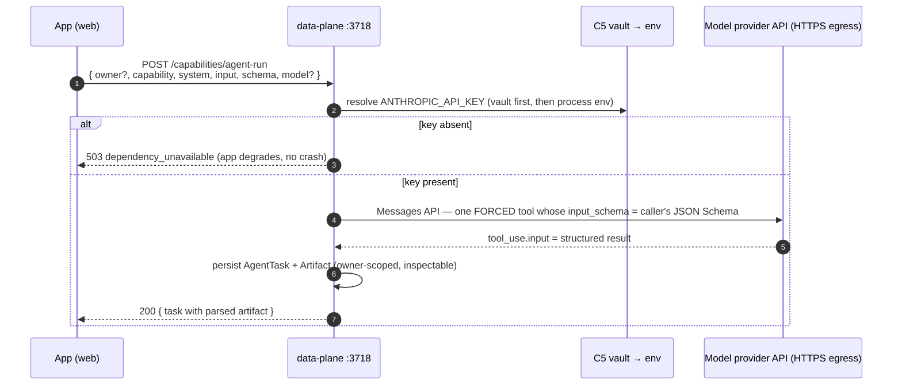
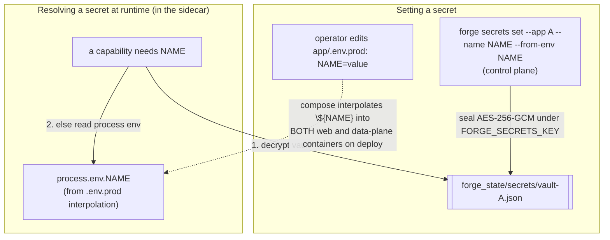
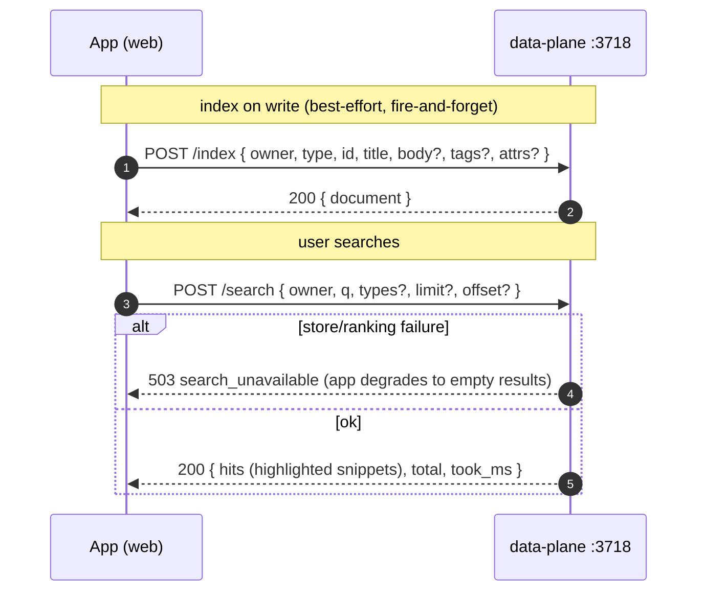

# 3 · Runtime call paths

How a **deployed** consumer app reaches each capability at runtime — the real mechanisms, not an
abstraction. Every path below is served by the **data-plane sidecar** in production (and by the control
plane in dev, from the same source), reached at `FORGE_EVENTS_URL = http://data-plane:3718`.

Common conventions across the data-plane HTTP routes:

- **App scoping.** Each route takes an optional `app` (the Application *name*). The single-app sidecar
  **defaults it to `FORGE_APP_NAME`**, so the app usually omits it.
- **Owner scoping (C11).** `owner` is the opaque per-user id (the C10 session `userId`). Passed on writes
  and reads for per-user data; the platform stamps it on writes and filters to it on reads, so user A can
  never read user B. Omitting `owner` is app-scoped. **Trust model is app-asserted**: the private sidecar
  trusts the `owner` the app sends (the app has already authenticated the user) — there is no per-user
  token scheme between app and sidecar.
- **Error contract.** Typed JSON errors `{ error: { code, message, retry } }`. Absent dependencies
  degrade **detectably** (a `503 dependency_unavailable`), never crash.

## A · App records / queries its event log (C3)

Fire-and-forget on the write side: a failed emit must never break the mutation that triggered it.

```mermaid
sequenceDiagram
    autonumber
    participant App as App (web)
    participant DP as data-plane :3718
    participant Vol as forge_state volume
    App->>DP: POST /app-events { type, subject?, owner?, data? }
    DP->>Vol: append to app-events/&lt;appId&gt;.jsonl
    DP-->>App: 200 { event }
    Note over App,DP: later — render a user's timeline
    App->>DP: GET /app-events?owner=&lt;userId&gt; limit=50
    DP->>Vol: read + filter by (app, owner)
    DP-->>App: 200 { events }  (newest-first, only this owner's)
```

## B · Scheduler fires a background job (C2)

The one **Forge → app** direction. The scheduler ticker runs *inside the sidecar* and calls back into the
app over the `internal` network, authenticating as a **service** (not a user).

```mermaid
sequenceDiagram
    autonumber
    participant Tick as Scheduler ticker (in data-plane)
    participant Store as ScheduledJob store
    participant Sec as C5 vault (AUTH_SERVICE_TOKEN)
    participant App as App (web) /api/cron/*
    loop every ~20s
        Tick->>Store: due jobs? (durable ScheduledJob resources)
        Store-->>Tick: [job]
        Tick->>Sec: resolve service token for the app
        Tick->>App: <job.method> http://web:PORT<job.path><br/>x-forge-service-token + Authorization: Bearer
        App-->>Tick: 2xx / non-2xx
        Tick->>Store: advance next_run_at; record JobRan / JobRunFailed
    end
```

- Jobs are **durable `ScheduledJob` resources**, so the ticker resumes across restarts — a job due while
  the plane was down fires on the next tick after boot.
- The app's session gate lets `/api/cron/*` through **only** when the request carries the valid
  `AUTH_SERVICE_TOKEN` (sent under both a dedicated header and `Bearer`). No token configured ⇒ the gate
  rejects it (401) — closed, detectable, never silently open.
- Jobs are declared by the app in a `forge.jobs.json` file that `productionize` mounts into the sidecar
  (`FORGE_JOBS_FILE`); the sidecar registers them on boot.

## C · Model / agent access (C1)

The app invokes a model with an **enforced output schema** and gets a parsed, persisted result.



- Structured output is enforced provider-natively (a forced tool call), so the app gets a result matching
  its schema or a recorded **failure** — every run (success and failure) is persisted as an inspectable
  `AgentTask`.
- The model credential comes from the C5 vault (see D). The model provider is an **Implementation** behind
  the capability contract — swappable without changing the `agent-run` API.

## D · Secret injection & resolution (C5)

Two supported ways a value reaches the runtime; capabilities resolve **vault first, then process env**.



- The plaintext never lands in source, a compose file, or an image layer — only `FORGE_SECRETS_KEY` (the
  master key) and the sealed vault (on the `forge_state` volume) exist at rest.
- A **declared** secret gets a `${NAME:-}` interpolation line in the generated compose for *both* the web
  and data-plane containers; a deploy-required one (e.g. `AUTH_SESSION_SECRET`) is emitted as `${NAME:?…}`
  so a missing value **fails the deploy loudly** rather than silently logging everyone out.

## E · Search query (C19)

Owner-scoped, BM25-ranked full-text over documents the app indexes alongside its own mutations.



- A `/search` is implicitly `WHERE owner = <caller>` and never returns another owner's document. Writes
  are best-effort (the app swallows failures; `/reindex` is the backstop); the user-invoked `/search`
  returns real 400s on bad input and a soft `503` on internal failure (never a 500).

## F · Blob upload & serve (C20)

Multipart upload → opaque `blob_id`; owner-scoped, Range-capable streaming reads. Bytes ride the
`forge_state` volume, so uploads survive a redeploy like auth/secrets.

```mermaid
sequenceDiagram
    autonumber
    participant B as Browser
    participant App as App (web) — own auth-checked route
    participant DP as data-plane :3718
    participant Vol as forge_state (blobs/bytes/…)
    B->>App: upload file (app authenticates the user)
    App->>DP: POST /blobs (multipart: file + owner + content_type)
    DP->>DP: hash + size + magic-byte sniff vs declared type + quota check
    DP->>Vol: atomic write (temp → rename) + metadata
    DP-->>App: 201 { blob_id, size, checksum, content_type }
    Note over B,DP: later — serve bytes
    B->>App: GET /files/:id (app checks the user owns it)
    App->>DP: GET /blobs/:id?owner=&lt;userId&gt;  (Range supported)
    DP-->>App: 200/206 stream + ETag + Cache-Control: private, immutable
```

- A blob owned by someone else returns **404 (absent)**, never 403 — the app fronts these with its own
  auth-checked route; Forge enforces `owner` on the raw GET as defense-in-depth. Uploads validate
  magic bytes against the declared type and enforce per-owner byte/object quotas.

## G · Auth & session (C10 + C11)

The most distinctive path. The app ships **no auth UI and no auth tables**. It proxies `/auth/*` to the
sidecar **same-origin** (so the cookie is set on the app's own domain) and gates the rest of itself by
**verifying the signed session cookie locally**, with no per-request round-trip.

```mermaid
sequenceDiagram
    autonumber
    participant B as Browser
    participant App as App (web) — Next rewrites() + middleware
    participant DP as data-plane :3718 (hosted /auth/*)
    participant IdP as OAuth IdP / SMTP (optional, egress)

    B->>App: GET /auth/login
    App->>DP: same-origin rewrite → GET /auth/login (hosted, themed page)
    DP-->>B: login form (rendered from the app's C16 theme)
    B->>App: POST /auth/login (credentials) — or /auth/google → IdP → callback
    App->>DP: rewrite → POST /auth/login
    DP->>IdP: (password: none) / (Google: code exchange, OIDC id_token)
    DP-->>B: 302 + Set-Cookie forge_session (HS256 JWS, ~15m)<br/>+ Set-Cookie forge_refresh (opaque, ~30d)

    Note over B,App: every subsequent request
    B->>App: GET /dashboard (cookies attached, same origin)
    App->>App: verifySessionToken(cookie, AUTH_SESSION_SECRET) LOCALLY — no round-trip
    alt access token valid
        App-->>B: 200 (userId available → used as `owner` for C1/C3/C4/C19/C20)
    else access expired but refresh present
        App->>DP: POST /auth/refresh (forwards forge_refresh)
        DP-->>App: new forge_session (+ rotated forge_refresh)
        App-->>B: 200 (+ refreshed cookies)
    else no valid session
        App-->>B: 302 /auth/login  (protected API → 401; /api/cron → service-token gate)
    end
```

Why this shape:

- **Two tokens.** `forge_session` is a short-lived (~15 min) HS256 **JWS the app verifies locally** with
  the shared `AUTH_SESSION_SECRET` (signed by the sidecar, verified in the app — no network hop per
  request). `forge_refresh` is an **opaque**, long-lived (~30 day), single-use, server-rotated token the
  app only forwards to `/auth/refresh`. A revoked session mints no new access token, so exposure after
  logout/reset is bounded to the short access window.
- **Same-origin proxy.** A Next.js `rewrites()` rule (always emitted, destination defaults to the
  in-cluster `http://data-plane:3718`) sends `/auth/*` to the sidecar so the cookie lands on the app's
  domain. The rule is baked into `next build` unconditionally — gating it on a runtime env would compile
  it out of the image and 404 `/auth/*` in prod.
- **The app mirrors, never imports.** The session token/cookie contract is a small, dependency-free
  reference module (`shared/session.ts`) the app copies into its own `middleware.ts`. `AUTH_SESSION_SECRET`
  is a C5 secret injected into **both** the sidecar (which signs) and the app (which verifies).
- **Ownership (C11)** is just the `userId` from the verified session, passed as `owner` to the data-plane
  routes — the same dimension that partitions events, notifications, agent runs, search, and blobs.
