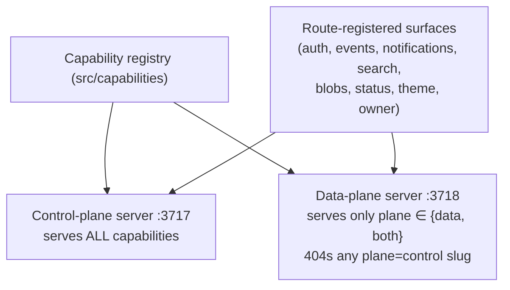

# 4 · Capability catalog

Every shipped capability, the **plane** it runs in, and the concrete way a consumer app (or an operator)
reaches it. "Plane" is the capability's declared `plane` field, or — for route-registered capabilities —
which server(s) mount the routes.

- **control** = dev/build/orchestration only (control-plane image).
- **data** = the running production app calls it (data-plane sidecar).
- **both** = mounted/served on both planes from one source (identical in dev and prod).

## Platform capabilities (the `Cn` ledger)

| Cn | Capability | Plane | How the app / operator reaches it |
|---|---|---|---|
| **C1** | Model / agent runtime | **data** (control inspects) | `POST /capabilities/agent-run` on the sidecar — `{ owner?, capability, system, input, schema, model? }` → parsed structured result; persisted `AgentTask`+`Artifact`. Model key from C5. |
| **C2** | Scheduler / jobs | **both** (registration = control; the running ticker = data) | App declares jobs in `forge.jobs.json` (mounted, `FORGE_JOBS_FILE`); the sidecar ticker calls back `<method> http://web:PORT<path>` with the C5 service token. Register/inspect via `POST /capabilities/schedule-job`. |
| **C3** | App event log / timeline | **both** (routes on both servers) | `POST /app-events` · `GET /app-events?owner=&subject=&limit=` · `GET /app-events/latest`. Best-effort write; owner-scoped read. |
| **C4** | Notifications | **both** | `POST /notifications` (upsert by key) · `POST /notifications/dismiss` · `POST /notifications/clear` · `GET /notifications?owner=&include_dismissed=`. |
| **C5** | Secrets | **both** (CLI writes = control; the store the app reads = data) | Write: `forge secrets set/unset` (control) → AES-256-GCM vault on `forge_state`. Read: capabilities resolve **vault → process env** at runtime; declared secrets also injected via `.env.prod` interpolation into web + sidecar. |
| **C6** | Health / telemetry | **both** (contract owned by platform; endpoint served by the app) | The **app** serves `/api/health` in the standard schema (`{status, service, time, checks[]}`); Forge owns the schema + aggregator + readiness→HTTP-code rule. Consumed by `forge inspect health` (control), C14 verify, and the C15 status probe. |
| **C7** | Deploy | **control** (`requiresDocker`) | `forge deploy --app <a>` — start-first zero-downtime roll of `compose.prod.yaml` behind Traefik, against a target daemon (`--context`, e.g. SSH), with the P14 drift gate. |
| **C8** | Productionize | **control** | `forge productionize --app <a> [--host …]` — generates the Next standalone `Dockerfile`, `compose.prod.yaml` (web + sidecar [+ db], Traefik labels), `.env.prod.example`, starter theme, and the per-app runbook. Also `--web-image <pin>` to repin. |
| **C9** | Feature-intake (Gate 0) | **process** (no runtime code) | A design-time gate: every new feature is ruled app-local vs. platform *before* app code is written, so platform pressure becomes a `Cn` up front. Lives in the orchestration process, not in an image. |
| **C10** | Identity / auth + sessions | **both** (hosted `/auth/*` served on the sidecar in prod) | App proxies `/auth/*` same-origin to the sidecar (hosted login/signup/verify/forgot/reset/google/logout/refresh/session pages + handlers). App verifies the `forge_session` JWS **locally**. See [call path G](03-call-paths.md#g--auth--session-c10--c11). |
| **C11** | Permissions / per-user ownership | **both** | An `owner` dimension on C1/C3/C4/C19/C20 (the session `userId`), enforced platform-side. Plus a one-time `POST /owner/claim-legacy` migration to assign owner-less records to a seeded owner. |
| **C12** | Transactional email | **data** (sent at runtime; control inspects) | `POST /capabilities/send-email` — inline `{subject, html/text}` or a built-in `verify-email` / `reset-password` template. Provider (SMTP) creds from C5; every send persisted (redacted) as `EmailDelivery`. |
| **C13** | Operator provisioning | **control** (generated artifacts) | The secret/token **catalog** driving the top-level `PROVISIONING.md` (full matrix) + a per-app `PROVISIONING.md` runbook and `.env.prod.example` generated by `productionize`, so an operator never sees a bare, unexplained `NAME=`. |
| **C14** | `forge verify` | **both** | `forge verify --app <a> --host <h>` — read-only post-deploy contract smoke: asserts C6 health (200 + standard schema), C10 gates (page→302, protected API→401, cron→403), and `/auth/config`. Non-zero exit on any failed assertion. |
| **C15** | Status page | **both** (public render on the sidecar in prod) | Public `GET /status` (+ `/status.json`) — themed Statuspage-style dashboard aggregating live C6 health + uptime history + operator incidents. Operator write surface: `POST /status/incidents[/update|/resolve]`, `GET /status/incidents`. |
| **C16** | App theming | **both** | `GET /theme.css` — the app's `--forge-*` design tokens + sandboxed custom CSS, from a committed `forge.theme.json` (mounted, `FORGE_THEME_FILE`). The auth (C10) + status (C15) pages render from the same tokens, so theming once themes all platform-served UI. |
| **C17** | Attribution | **filed — not built in this repo** | No implementation, routes, or tests present. Reserved capability number. |
| **C18** | `forge release` | **control** | `forge release --app <a>` — the end-to-end pipeline: `assess → publish → repin → deploy → verify`, atomic and idempotent (re-runs resume from the first unsatisfied phase; any phase failure aborts with prod left on last-good). |
| **C19** | Search / full-text | **both** | `POST /index` · `POST /index/delete` · `POST /reindex` · `POST /search` — BM25-ranked, `<mark>` snippets. **Access-aware:** docs may carry ACL metadata (`groupId`, `visibility` `private\|group\|shared`, `sharedWith`/`sharedWriters`); a `/search` `scope` (`{ groupId?, canReadAll? }`) returns the caller's own docs PLUS authorized group/shared docs (predicate applied in the index, before paging). Omit scope / no ACL metadata ⇒ owner-only (backward compatible). Best-effort writes; soft `503` on internal search failure. |
| **C20** | Blob storage | **both** | `POST /blobs` (multipart → `blob_id`) · `GET /blobs/:id?owner=` (Range/ETag) · `DELETE /blobs/:id` · `GET /blobs`. Bytes + metadata on the `forge_state` volume; magic-byte validation + per-owner quotas. |
| **C21** | Notification delivery channels | **filed — not built in this repo** | No implementation present. C4 persists in-app notifications; a delivery-channel layer (web push / native push / email fan-out) is proposed — see [Planned](06-planned-capabilities.md). |
| **C22** | Agent tools / web access | **filed — not built in this repo** | No implementation present. C1 today invokes a model with a forced-tool structured-output schema; a general server-side tool/web-access surface for the agent is proposed. |

> **Honesty note.** C17, C21, and C22 appear as reserved capability numbers but have **no code, routes, or
> tests** in this repository as of this writing. They are documented as *filed, not built*. C1's current
> shape (a single forced tool that enforces the output schema) is the nearest shipped relative of C22.

## The control-plane dev/build surface (underlying capability registry)

Beyond the `Cn` platform capabilities, the control plane exposes the **dev/build slice** the CLI drives.
These are `plane: control` and never run in a production stack:

| Capability | CLI | Resource |
|---|---|---|
| InitializeApp | `forge init app --name <n>` | `Application` (scaffolds a Dockerized Next.js app) |
| ProvisionEnvironment | `forge provision --app <n> [--secret NAME] [--host …]` | `Environment` (compose + declared infra/secrets) |
| InstallDependencies | `forge install --app <n>` | `DependencyInstall` |
| RunDevServer | `forge dev --app <n>` | `DevServer` |
| Build / Test / Lint | `forge build|test|lint --app <n>` | `Build` / `TestRun` / `CheckRun` (in ephemeral Docker) |
| Inspect | `forge inspect <type> --app <n>` | `Inspection` (`plane: both` — observability) |
| ExplainFailure | `forge explain --resource <id>` | `Analysis` |
| GenerateFeaturePlan | `forge plan --app <n> --goal "…"` | `Plan` |

Every capability is invoked identically over HTTP — `POST /capabilities/:slug` — and discoverable via
`GET /capabilities`. Humans and agents use the **same** contract.

## How the planes decide what to serve

