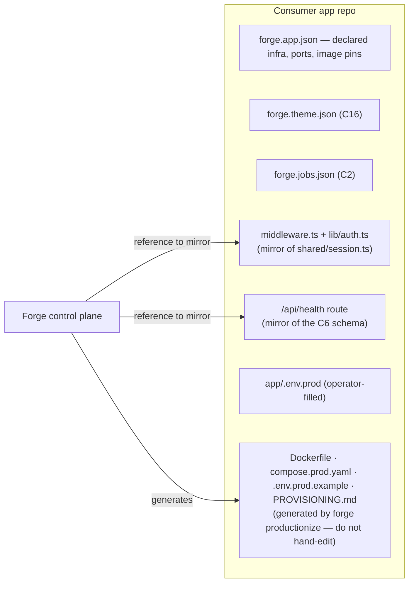

# 5 · How a consumer app adopts a capability

The developer-facing consumption model. A consumer app never imports a Forge package; adopting a
capability means **taking a generated recipe, pinning images, declaring config, and (for some
capabilities) mirroring a small reference module**. This is the same contract for every app.

## The five adoption surfaces



### 1 · Pin the images (digest-pinned, multi-arch)

Adoption is versioned by **digest pin**. The app's `compose.prod.yaml` pins both:

- `web: <app>-app@sha256:<digest>` — the app's own image, published by its CI.
- `data-plane: forge-data-plane@sha256:<digest>` — the platform sidecar version being adopted.

`forge productionize --web-image <pin>` and `forge release` converge these pins; a deploy **fails** if the
running image doesn't match its pin (the drift gate). Adopting a *new* platform capability version = repin
the `data-plane` digest and redeploy.

### 2 · Declare with `provision` flags

The app declares what it needs so `productionize` wires it:

- `forge provision --app <a> --secret <NAME> …` — declares a secret so the generated compose interpolates
  `${NAME}` into the web **and** sidecar containers (and the runbook explains it). Undeclared secrets can't
  be injected.
- `--host <public-host>` — bakes the Traefik router rule + the readiness healthcheck.
- Infra flags (Postgres/Redis) add those services + their URLs.

### 3 · Receive injected config / env

At deploy time the generated compose injects, with no app code change:

| Injected value | Into | Purpose |
|---|---|---|
| `FORGE_EVENTS_URL` / `FORGE_DATA_PLANE_URL` = `http://data-plane:3718` | web | Base URL the app's clients call for C1/C3/C4/C19/C20. |
| `FORGE_APP_NAME`, `FORGE_APP_REPO_PATH`, `FORGE_STATE_DIR=/forge-state` | data-plane | Single-app identity + durable state root. |
| `FORGE_APP_CALLBACK_HOST=web`, `FORGE_APP_CALLBACK_PORT`, `FORGE_READINESS_PATH` | data-plane | How the sidecar reaches back into the app (C2 cron, C15 probe). |
| `FORGE_SECRETS_KEY` | web + data-plane | Master key to decrypt the C5 vault at rest. |
| Declared secrets (`AUTH_SESSION_SECRET`, `ANTHROPIC_API_KEY`, `SMTP_URL`, `GOOGLE_CLIENT_*`, …) | web + data-plane | `vault → env` resolution; deploy-required ones use `${NAME:?}` so a missing value fails loudly. |
| `FORGE_JOBS_FILE`, `FORGE_THEME_FILE` | data-plane | Mounted `forge.jobs.json` (C2) / `forge.theme.json` (C16). |

### 4 · Adopt the HTTP surface (client-side patterns)

Most capabilities are reached with a **plain `fetch`** to `FORGE_EVENTS_URL` — there is no client library
to install. The app writes thin clients following the conventions:

- **Write-side is fire-and-forget** for C3/C4/C19 (a failed emit must not break the mutation): short
  timeout, swallow errors, backfill via `/reindex` (C19) if needed.
- **Pass `owner`** (the session `userId`) on per-user reads/writes so data is partitioned per user.
- **Absent dependency ⇒ degrade**: a `503 dependency_unavailable` (no model key, no SMTP) is expected and
  handled, not a crash.

### 5 · Mirror the reference modules (never import)

Two capabilities need a small piece of platform logic *inside* the app. The app **copies** the canonical
reference (it is pure and dependency-free), it does not import it:

- **C10 session gate** — mirror `shared/session.ts` into `middleware.ts` / `lib/auth.ts`: parse cookies,
  `verifySessionToken(forge_session, AUTH_SESSION_SECRET)` locally, refresh via `POST /auth/refresh` when
  the access token is expired but a refresh cookie is present, redirect unauthenticated page requests to
  `/auth/login`, and gate `/api/cron/*` on the service token. The app also adds the always-on Next
  `rewrites()` rule for `/auth/*`.
- **C6 health** — serve `/api/health` in the standard schema, running the app's own opaque checks (e.g. a
  DB `SELECT 1`) and letting the shared aggregator decide `ok` / `degraded` / `unavailable` and the
  readiness HTTP code.

## The adoption lifecycle

```mermaid
sequenceDiagram
    autonumber
    participant Dev as App developer/agent
    participant CP as Forge control plane
    participant Repo as App repo
    participant Prod as Production host
    Dev->>CP: forge provision --app A --secret NAME --host H
    Dev->>Repo: adopt code (thin fetch clients / mirror session+health / declare jobs+theme)
    Dev->>CP: forge productionize --app A  (--web-image &lt;pin&gt;)
    CP->>Repo: write Dockerfile, compose.prod.yaml (web + sidecar pins), .env.prod.example, PROVISIONING.md
    Dev->>Prod: operator fills app/.env.prod (secrets, FORGE_SECRETS_KEY)
    Dev->>CP: forge release --app A  (assess→publish→repin→deploy→verify)
    CP->>Prod: start-first roll + drift gate + post-deploy contract smoke
    Note over Dev,Prod: adopting a new capability version = repin the data-plane digest + redeploy
```

## Non-negotiables an app inherits

- **Digest pins, multi-arch.** Never `:latest` in a prod compose; every pin is `ref@sha256:<digest>`.
- **Secrets never in source.** Values live only in the C5 vault (sealed) or `app/.env.prod` (uncommitted).
- **Same-origin auth.** `/auth/*` is proxied to the sidecar; the app ships no auth UI or tables.
- **Detectable degradation.** A missing dependency surfaces as a typed `503`, and `/auth/config` /
  `forge verify` let you confirm what's actually enabled before shipping.
