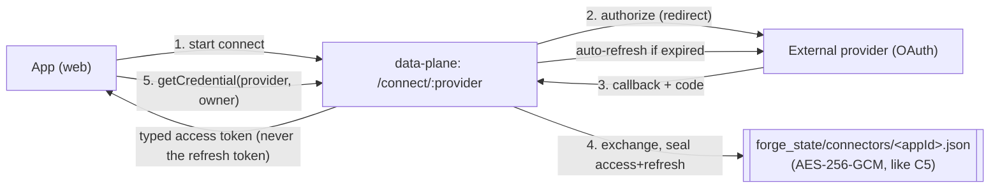
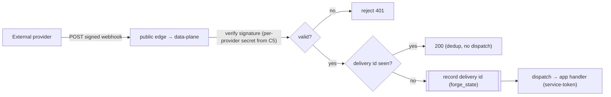
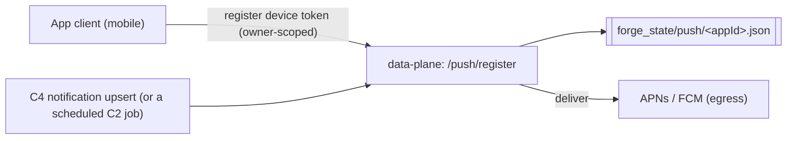
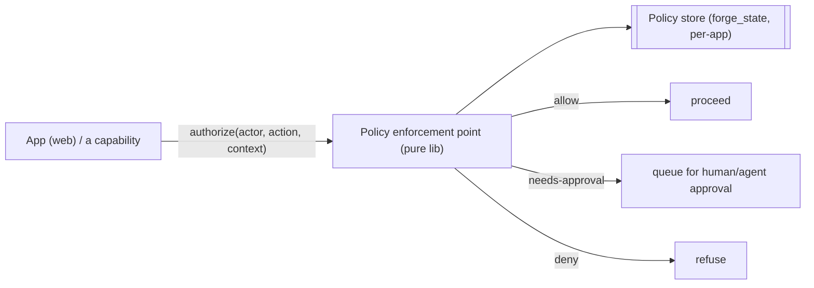
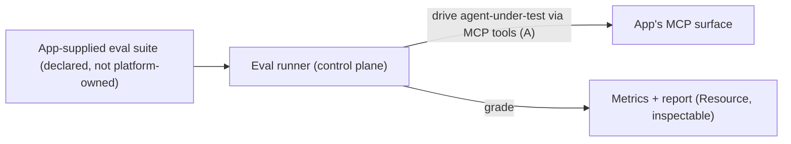

# 6 · Planned capabilities & extension points

> **PROPOSED — NOT YET BUILT.** Nothing in this document is implemented in the platform today. It maps
> where each **generic** capability family *would* plug into the current architecture (which plane, the
> call-path shape, the sidecar/external touchpoints, and the concerns each raises). Described
> product-agnostically: "the app" is any consumer app that declares the surface.

## The one architectural gap they all share

Every shipped data-plane capability is reached **inbound-from-the-app** (the app calls
`http://data-plane:3718`) or **app↔sidecar over the private `internal` network**. The sidecar has **no
public ingress** today — only `web` sits on the `proxy` network. Several proposals below require
**external parties to reach the platform directly** (an MCP host, an email provider, a webhook sender).
That means a new, deliberate **public edge**: either

- **(a)** a Traefik-routed path on the app's host that the app **proxies** to the sidecar (the same
  same-origin trick C10 already uses for `/auth/*`), or
- **(b)** a new externally-routable sidecar service on the `proxy` network with its own TLS host.

Each external-facing proposal below names which it assumes. This is the highest-leverage design decision
in the set and should be settled once, generically, before any one of them ships.

---

## A · Remote MCP-server hosting + OAuth 2.1 authorization server

**Plane:** data (public edge + sidecar-resident), with a small control-plane declaration step.
**Shape:** the platform hosts the app's declared tool surface as a **remote MCP server** (HTTP/SSE)
reachable by external MCP hosts, and acts as the **OAuth 2.1 authorization server** that gates it.

The app **declares** a tool surface (tool names, schemas, and a versioned server *instruction block*);
the platform **serves** it. Tool *execution* dispatches back into the app (the app owns the behavior,
exactly as C1/C2 keep domain logic in the app). Authorization is full OAuth 2.1: user consent,
PKCE, dynamic client registration (RFC 7591), and scoped, short-lived access tokens — reusing C10's
identity + C11's ownership as the resource owner.

```mermaid
sequenceDiagram
    autonumber
    participant Host as External MCP host / agent
    participant Edge as Public edge (Traefik → app proxy OR sidecar host)
    participant AS as Authz server (OAuth 2.1, sidecar-resident)
    participant User as Resource owner (browser)
    participant MCP as MCP endpoint (HTTP/SSE, sidecar)
    participant App as App (web) — tool dispatch

    Host->>Edge: dynamic client registration (RFC 7591)
    Edge->>AS: register client → client_id
    Host->>AS: /authorize (PKCE challenge, scopes)
    AS->>User: consent screen (themed via C16; identity via C10)
    User-->>AS: approve
    AS-->>Host: authorization code
    Host->>AS: /token (code + PKCE verifier)
    AS-->>Host: short-lived scoped access token
    Host->>MCP: initialize → serves versioned INSTRUCTION BLOCK
    Host->>MCP: tools/list  (the app's declared surface)
    Host->>MCP: tools/call (Bearer scoped token)
    MCP->>AS: validate token + scope
    MCP->>App: dispatch tool → app executes (owner-scoped)
    App-->>MCP: result
    MCP-->>Host: tool result (SSE stream)
```

- **Versioned instruction block.** The app declares it (like `forge.jobs.json` / `forge.theme.json`,
  mounted into the sidecar); the platform serves it verbatim to a connecting host and versions it so a
  host can detect changes.
- **Per-integration scheduled prompt.** A natural composition with **C2**: a scheduled task periodically
  prompts the *connected external agent* to call a designated app tool (an outbound nudge on a cron). This
  reuses the durable-`ScheduledJob` machinery; the callback target is the connected MCP host rather than
  `/api/cron/*`.
- **Touchpoints:** public edge (new), C10 (identity/consent), C11 (owner scoping of tokens), C16 (themed
  consent UI), C2 (the periodic prompt). **Concerns:** token/consent storage is new sensitive state on
  `forge_state`; the OAuth AS is security-critical and must be spec-faithful; SSE means long-lived
  connections the sidecar must hold.

---

## B · Third-party connector vault (outbound OAuth)

**Plane:** data (sidecar-resident vault + accessor), control-plane declaration of providers.
**Shape:** the OAuth **client** dance *to* external providers, an **encrypted token vault** (access +
refresh), automatic refresh, and a typed server-side **credential accessor** the app calls.



- This is the **inverse** of proposal A: A is Forge-as-authz-server (inbound); B is Forge-as-OAuth-client
  (outbound). B reuses C5's seal-at-rest pattern and C11's owner scoping (tokens are per-user).
- **Touchpoints:** the C5 encryption model, C11 ownership, a small public callback path.
  **Concerns:** refresh-token rotation + revocation; per-provider quirks live behind an Implementation
  boundary (like C10's `OAuthProvider`).

---

## C · Inbound email ingestion

**Plane:** data, **public edge required** (an MX/receiving endpoint).
**Shape:** a per-user forwarding address; **receive → verify (SPF/DKIM/anti-spoof) → parse → dispatch to an
app handler** (symmetric with how C2 dispatches cron into the app).

```mermaid
sequenceDiagram
    autonumber
    participant Sender as External sender
    participant MX as Inbound MX / provider webhook (public edge)
    participant DP as data-plane ingestion
    participant App as App (web) handler
    Sender->>MX: email → user+&lt;token&gt;@app-domain
    MX->>DP: raw MIME (or provider inbound-parse webhook)
    DP->>DP: verify SPF/DKIM, anti-spoof; resolve owner from the address token; parse MIME
    DP->>App: POST /api/inbound/email { owner, parsed } (service-token auth, like C2)
    App-->>DP: 2xx
```

- Reuses the **C2 dispatch-into-the-app** shape and the C11 owner mapping (the address token → `owner`).
  Complements **C12** (outbound) to make email bidirectional.
- **Concerns:** the anti-spoof verification is security-critical; the per-user address scheme + the public
  receiving edge are both new.

---

## D · Webhook ingestion framework

**Plane:** data, **public edge required**.
**Shape:** verified (HMAC/signature), **idempotent** receipt + dispatch of external-provider webhooks,
with subscription lifecycle management.



- Generic sibling of C, sharing the public edge, the C5-held signing secrets, and the C2-style dispatch.
  The **idempotency ledger** (seen delivery ids) is new durable state on `forge_state`.
- **Concerns:** replay/idempotency window sizing; per-provider signature schemes behind an Implementation
  boundary; subscription create/rotate/delete lifecycle.

---

## E · Native mobile push (APNs / FCM)

**Plane:** data (delivery from the sidecar; egress to Apple/Google).
**Shape:** device-token **registration** + **delivery**. This is the concrete **C21** (notification
delivery channel) for mobile: C4 already persists in-app notifications by key/owner; a push channel fans a
C4 upsert out to registered devices.



- **Touchpoints:** C4 (the source of a notification), C11 (owner→devices), C5 (APNs/FCM credentials), C2
  (server-initiated pushes while the user is away). **Concerns:** token invalidation/cleanup; provider
  credential formats (APNs key vs. FCM) behind an Implementation.

---

## F · Deterministic authorization / policy engine

**Plane:** **both** — a shared, pure enforcement library (like the C6 health schema and the C10 session
module) plus a policy store.
**Shape:** a policy store + a server-side **enforcement point**
`authorize(actor, action, context) → allow | needs-approval | deny`, supporting *progressive autonomy*.
**Fully deterministic — no model calls.**



- Positioned as the generic form of the domain-model's *Policies decide whether something is allowed;
  Permissions decide whether a Builder may act.* It generalizes C11 from "owner == you" to
  role/attribute/progressive-autonomy rules, and would be the natural gate the MCP tool-call path (A) and
  the connector accessor (B) consult. **Because it is deterministic and pure**, it can be mirrored into the
  app like C6/C10 — no round-trip on the hot path. **Concerns:** policy authoring/versioning UX; the
  `needs-approval` state needs a durable queue + a resolution surface.

---

## G · Multi-member identity + roles + shared/private scoping

**Plane:** both (extends C10 hosted auth + C11 ownership).
**Shape:** group/organization accounts, **roles**, and role-gated + **shared/private** data scoping —
the multi-tenant generalization of today's single-owner model.

- **Extends C11's `owner` dimension** from a single user id to a **scope** — `(app, owner)` becomes
  `(app, group, visibility, member)` — so the *same* per-record filter that powers C1/C3/C4/C19/C20 gains
  shared-vs-private semantics without each capability re-implementing tenancy.
- **Extends C10** with group creation, invitations, and role assignment on the hosted `/auth/*` surface.
- Pairs naturally with **F** (roles as policy inputs). **Concerns:** a data migration for existing
  single-owner records (C11 already has a `claim-legacy` precedent); every owner-scoped read across the
  catalog must adopt the richer scope in lockstep.

---

## H · AI evaluation harness (control-plane)

**Plane:** **control** (explicitly *not* in the production data path).
**Shape:** a generic eval **runner** that drives an **agent-under-test** through a consumer app's MCP tools
(proposal A) and **grades metrics**; the consumer app supplies its own eval suites; the harness lives in
the control plane alongside build/test/verify.



- Sits beside **C14 verify** and the dev/build slice as a control-plane capability: it produces an
  inspectable result Resource + emits facts, and it consumes the **remote-MCP surface (A)** as its driving
  interface — so A is effectively a prerequisite. The app owns *what good looks like* (its suites); the
  platform owns the runner + grading harness + reporting. **Concerns:** it depends on A shipping first;
  grading determinism vs. model-graded metrics is a design fork (this proposal keeps the *runner*
  control-plane and deterministic even if individual graders call a model).

---

## Where each proposal lands (summary)

| Proposal | Plane | New public edge? | Heaviest reuse | Key new state on `forge_state` |
|---|---|---|---|---|
| A · Remote MCP + OAuth 2.1 AS | data | **yes** | C10, C11, C16, C2 | consent grants, issued tokens, client registrations |
| B · Connector vault (outbound OAuth) | data | small callback | C5, C11 | sealed access+refresh tokens |
| C · Inbound email | data | **yes (MX)** | C2 dispatch, C11, C12 | per-user address map |
| D · Webhook ingestion | data | **yes** | C5, C2 dispatch | idempotency/delivery ledger, subscriptions |
| E · Native push (C21) | data | no (egress) | C4, C11, C5, C2 | device-token registry |
| F · Policy engine | both (pure lib) | no | C11, domain Policies | policy store, approval queue |
| G · Multi-member identity | both | no | C10, C11 | groups, roles, memberships |
| H · Eval harness | **control** | no | C14, A | eval results (Resources) |

The recurring theme: the **sidecar + a deliberate public edge** is the locus for the external-connectivity
set (A–D), the **`owner` scope** is the reuse hinge for the data set (E–G), and the **control plane** is
where anything build/test/eval-shaped belongs (H) — consistent with the two-plane split the rest of this
document describes.
