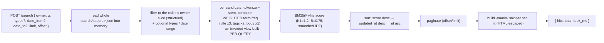

# 7 · Data storage (concrete, per-capability)

> **Verified against the code in this repo, not inferred.** Every claim below maps to a specific store
> implementation under `src/storage/` or `src/plugins/`. This doc de-abstracts the `forge_state` volume:
> there is no single "state blob" — each capability has a **named, separately-shaped** backing store.

## The headline facts

1. **The platform's own state is plain files** — JSON documents + append-only JSONL + opaque binary blob
   files — on **one named volume, `forge_state`**, mounted at `FORGE_STATE_DIR` (`/forge-state` in the
   prod sidecar; `workspace/.forge` in dev). There is **no database engine** behind any Forge capability
   in v1.
2. **Search (C19) is not Solr/Elasticsearch/Redis** — it is a self-contained **BM25(F)-lite ranker in
   pure TypeScript** over a per-app JSON file, recomputed in memory per query. Details in §2.
3. **Postgres and Redis are for the consumer app only** — no shipped Forge capability reads or writes
   them. They exist in a prod stack only when the app was provisioned with them. Details in §4.
4. **Concurrency safety is uneven.** The "engine" stores (C4, C10, C15, C19, C20) use a per-app async
   mutex + atomic temp-file rename. **The C5 secrets vault and the generic Resource store do neither** —
   they are plain read-modify-write / plain overwrite. Details in §5.

## 1 · The `forge_state` volume — exact per-capability on-disk layout

`forge_state` is a Docker **named volume** (a filesystem dependency, not a service) mounted into the
data-plane sidecar at `/forge-state`. Every path below is relative to that root
(`src/shared/paths.ts` is the single source of these paths).

| Capability | Path under `forge_state` | Format | Granularity | Write model | Impl |
|---|---|---|---|---|---|
| **C3** app event log | `app-events/<appId>.jsonl` | JSONL | one file per app | **append-only** (`appendFile`), no lock; migration rewrite is atomic temp+rename | `storage/store.ts` |
| **C4** notifications | `notifications/<appId>.json` | JSON keyed map `{ [owner+key]: Notification }` | one file per app | **read-modify-write**; per-app mutex + atomic temp+rename | `storage/store.ts` |
| **C5** secrets vault | `secrets/vault-<appId>.json` | JSON keyed map `{ [name]: {iv,tag,data} }`, **AES-256-GCM sealed**, mode `0600` | one file per app | **read-modify-write, plain `writeFile`, NO lock, NO atomic rename** ⚠ | `plugins/secrets-local` |
| **C5** dev master key | `secrets/master.key` | base64 32-byte key, mode `0600` | one, dev-only | written once when `FORGE_SECRETS_KEY` is unset (dev fallback) | `plugins/secrets-local` |
| **C10** identity | `auth/<appId>.json` | JSON doc: `users`, `email_index`, `provider_index`, `sessions`, `verify_tokens`, `reset_tokens`, `refresh_tokens`; mode `0600` | one file per app | **read-modify-write**; per-app mutex + atomic temp+rename | `plugins/auth-identity/store.ts` |
| **C15** uptime history | `uptime/<appId>.jsonl` (raw snapshots) + `uptime/<appId>.rollup.json` (per-day rollup) | JSONL + JSON | two files per app | RMW (raw is pruned + **rewritten whole** each sample, not appended); per-app mutex + atomic temp+rename | `storage/uptime-store.ts` |
| **C15** incidents | `incidents/<appId>.json` | JSON keyed map `{ [id]: Incident }` | one file per app | RMW + prune; per-app mutex + atomic temp+rename | `storage/incident-store.ts` |
| **C19** search index | `search/<appId>.json` | JSON keyed map `{ [owner+type+id]: SearchDocument }` | one file per app | RMW; per-app mutex + atomic temp+rename | `storage/search-store.ts` |
| **C20** blob metadata | `blobs/<appId>.json` | JSON keyed map `{ [owner+blob_id]: BlobMetadata }` | one file per app | RMW; per-app mutex + atomic temp+rename | `storage/blob-store.ts` |
| **C20** blob bytes | `blobs/bytes/<appId>/<blob_id>` | **opaque binary**, one file per blob (content-addressed by `blob_id`) | one file per object | streamed to `blobs/uploads/*.tmp`, then atomic rename into place under the per-app lock | `storage/blob-store.ts` |
| **C1/C2/C7/C12/C14** + core | `resources/<Type>/<id>.json` | JSON, one file per resource | one file per resource id | **plain `writeFile` per file, NO lock, NO atomic rename** ⚠ | `storage/store.ts` |
| Platform fact log | `events/events.jsonl` | JSONL | one global file | **append-only** (`appendFile`), no lock | `storage/store.ts` |
| Capability logs | `logs/<resourceId>.log` | plain text | one per resource | plain write (best-effort) | `storage/store.ts` |

**The generic Resource store** (`resources/<Type>/<id>.json`) backs every capability that persists a
first-class Resource rather than a bespoke store:

- **C1** model/agent runs → `resources/AgentTask/<id>.json` + `resources/Artifact/<id>.json`
- **C2** scheduled jobs → `resources/ScheduledJob/<id>.json` (mutated in place each tick as `next_run_at`
  advances)
- **C7** deploys → `resources/Deployment/<id>.json`
- **C12** email → `resources/EmailDelivery/<id>.json` (recipient redacted; no body/PII retained)
- **C14** verify → `resources/Verification/<id>.json`
- Dev/build slice → `Application`, `Environment`, `DependencyInstall`, `DevServer`, `Build`, `TestRun`,
  `CheckRun`, `Inspection`, `Analysis`, `Plan`

**Why bespoke stores exist alongside the Resource store:** the private stores (C5/C10 and the high-volume
C3/C4/C15/C19/C20) are deliberately **not** Resources so their contents (password hashes, sealed secrets,
per-user rows) never surface through the generic `GET /resources` read API, and so high-volume data
doesn't bloat that API.

## 2 · Search (C19) — what the index actually is

**There is no search engine process.** No Solr, no Elasticsearch, no Redis, no `lunr`/`flexsearch`
dependency. C19 is two pieces of first-party code:

- **The store** (`src/storage/search-store.ts`): a per-app **JSON file** `search/<appId>.json` — a keyed
  map of `SearchDocument` records (`{owner, type, id, title, body?, tags?, attrs?, created_at?,
  updated_at?}`), upserted by `(owner, type, id)`. This is the *only* persisted structure. **There is no
  persisted inverted index** — the file is the raw document set.
- **The ranker** (`src/search/rank.ts`): a **pure, in-memory BM25(F)-lite** function. No I/O.

**How a query executes** (`POST /search`):

- **Tokenizer/stemmer:** case-fold + a light custom stemmer (plural, then gerund/past — `meetings`→`meet`,
  `running`→`run`), no Porter dependency.
- **Scoring:** classic BM25 with field weighting (BM25F-lite): title matches outrank body-only matches;
  smoothed IDF so a common term never subtracts score.
- **Owner scoping is structural:** the store hands the ranker **only** the caller's owner slice; the pure
  ranker never sees another owner's documents, so there is no cross-owner surface at all.

**Limits (be honest with reviewers):**

- **O(documents-per-owner) per query, per app** — every search reads the whole app file and scores the
  owner's entire slice; the whole owner slice is held in memory during the query. Fine for per-app,
  per-user document counts; not a web-scale index.
- **No persistent inverted index / no incremental indexing** — term frequencies are recomputed each query.
- **Lexical only** — no phrase queries, no fuzzy/typo matching, no synonyms beyond the built-in stemmer,
  no relevance feedback.
- **Best-effort writes** — `/index` is fire-and-forget from the app; `/reindex` is the reconciliation
  backstop. `/search` degrades to a soft `503 search_unavailable` (never a 500) on an internal failure.
- **Scale-out path (planned):** the `SearchStore` class API is the seam — a real engine would slot behind
  it — but that is not implemented today (see §3).

## 3 · The store-interface abstraction — implemented vs. planned

**What is real today:** capabilities and routes **never touch the filesystem directly for platform
state** — they depend on the *method surface* of a store object: the singleton `store` (`Store` class) for
Resources/events/C3/C4, and the specialized singletons `searchStore`, `blobStore`, `uptimeStore`,
`incidentStore`, plus the C5/C10 module APIs. That indirection is genuine: a caller writes
`store.saveResource(...)` or `searchStore.search(...)` and does not know or care that the backing is a
file. So a backend swap would **not** ripple into capability code.

**What is NOT real today:** there is **no pluggable-backend interface with multiple implementations.**
Each store is a **single concrete class that hardcodes `node:fs` + JSON**. There is no
`StoreBackend`/`Datastore` interface, no `PostgresStore`, no `S3BlobStore`. The code comments state the
intent — `storage/store.ts`: *"Postgres comes later in service mode; the interface here is what
Capabilities depend on"*; `blob-store.ts`: *"Object store (S3/MinIO) is a scale-out swap behind the same
store API"* — but those are **aspirational**. As of this repo:

| Backend swap | Status |
|---|---|
| Filesystem JSON/JSONL/binary (all platform state) | **Implemented** — the only backend. |
| Postgres-backed Resource/event/state store | **Planned** — would replace the `Store` class internals (or introduce a backend interface). Not present. |
| S3/MinIO blob bytes | **Planned** — would live behind `BlobStore`'s `commit/get/delete/bytesFile`. Not present. |
| Real search engine behind `SearchStore` | **Planned** — the class API is the seam; no alternate impl exists. |

**Honest framing:** the seam today is *"callers depend on a store object's methods, not on files"* — good
hygiene that makes a future swap feasible — **not** *"a datastore interface with a filesystem
implementation you can reconfigure."* The swap is a future refactor, not a config flag.

## 4 · Postgres and Redis — app-only, provisioned-only

**Confirmed: no shipped Forge capability stores its state in Postgres or Redis.** All platform state is
the flat files in §1. Evidence in-repo: `src/search/rank.ts` states *"no Postgres for platform state —
Postgres in productionize is the APP's optional database, not Forge's"*, and the productionize compose
generator injects `DATABASE_URL` / `REDIS_URL` into the **`web` (app) container only** — the `data-plane`
sidecar's environment gets `FORGE_*` + declared secrets but **not** `DATABASE_URL` or `REDIS_URL`.

| Service | Exists when | Volume | Who uses it | Ports/URL |
|---|---|---|---|---|
| **postgres** (`postgres:16-alpine`) | only if the app was provisioned with a DB | `postgres_data` (separate named volume) | **the consumer app's own domain data** (its schema, its migrations) | `internal` net, `:5432`; `DATABASE_URL` → **web** only |
| **redis** (`redis:7-alpine`) | only if provisioned | none (in-memory) | **the app** (cache/queues, app's choice) | `internal` net, `:6379`; `REDIS_URL` → **web** only |

So a minimal app (no DB provisioned) runs with **just** `web` + the `data-plane` sidecar + the
`forge_state` volume — Postgres/Redis are absent entirely.

## 5 · Atomicity, concurrency, durability

**Durability across redeploys:** everything in §1 lives on the **`forge_state` named volume**, which
persists across the sidecar container recreate that `forge deploy` performs. That is what keeps signed-in
users (C10 sessions + refresh tokens), sealed secrets (C5), and stored blobs (C20) alive through a
deploy. An ephemeral filesystem would wipe them. Postgres data persists on its own `postgres_data` volume.

**Concurrency — two tiers in the code today:**

- **Guarded (safe under concurrent writes):** C4 notifications, C10 auth, C15 uptime, C15 incidents, C19
  search, C20 blob metadata. Each uses a **per-app async mutex** (a promise chain keyed by `appId`, so
  different apps never block each other) wrapping the read-modify-write, and replaces the file with an
  **atomic temp-file + `rename(2)`** so a concurrent reader sees either the whole old file or the whole
  new one, and two concurrent mutations never lose an update. This is exactly the fix for the
  lost-update class of bug (a prior C4 concurrency defect motivated the pattern).

- **Unguarded (⚠ not safe under concurrent writes):**
  - **C5 secrets vault** (`plugins/secrets-local`) — `setSecret`/`unsetSecret` do a read-modify-write of
    the whole vault with a **plain `writeFile` (no mutex, no atomic rename)**. Two concurrent
    `forge secrets set` calls to the same app can lost-update, and a crash mid-write can corrupt the
    vault file. In practice writes are serial (an operator's CLI), so this is low-risk, but it is
    genuinely the old C4 bug class, un-fixed. **Flag for review.**
  - **Generic Resource store** (`resources/<Type>/<id>.json`) — `saveResource` is a **plain per-file
    `writeFile` (no lock, no atomic rename)**. Because each resource is its own file keyed by a unique
    id, concurrent writes to *different* resources don't interfere; the exposure is (a) a crash mid-write
    truncating one resource's JSON (readers skip a corrupt file rather than crash), and (b) concurrent
    writes to the *same* resource id — which for the one mutable case (C2 `ScheduledJob` advancing each
    tick) is avoided because a single in-process, non-overlapping ticker owns those writes.

- **Append-only logs** (`events/events.jsonl`, C3 `app-events/<appId>.jsonl`) — `appendFile` with no
  explicit lock; they rely on POSIX `O_APPEND` write atomicity for concurrent small appends. Reads scan
  and parse the whole file, skipping any corrupt line.

- **Minor keying note (accuracy):** the C20 blob metadata key joins parts with a NUL byte
  (`String.fromCharCode(0)`), but the C19 search and C4 notification stores join owner + key with a
  **space** character (their code comments describe this as a NUL separator; the implementation uses a
  space). Owner ids are space-free, so this is not a live collision today, but it is a latent edge worth
  noting.

## 6 · The un-abstracted storage diagram

Each concrete backing store shown separately — no single "forge_state blob".

```mermaid
flowchart TB
  subgraph fs["forge_state (named volume) → /forge-state — ALL Forge platform state (flat files)"]
    direction TB
    res["resources/&lt;Type&gt;/&lt;id&gt;.json<br/>Resource store: C1 AgentTask+Artifact,<br/>C2 ScheduledJob, C7 Deployment,<br/>C12 EmailDelivery, C14 Verification, core<br/><i>plain writeFile · no lock ⚠</i>"]
    ev["events/events.jsonl<br/>platform fact log<br/><i>append-only</i>"]
    aev["app-events/&lt;appId&gt;.jsonl (C3)<br/>domain event log<br/><i>append-only</i>"]
    notif["notifications/&lt;appId&gt;.json (C4)<br/>keyed map<br/><i>mutex + atomic rename</i>"]
    sec["secrets/vault-&lt;appId&gt;.json (C5)<br/>AES-256-GCM sealed, 0600<br/><i>plain writeFile · no lock ⚠</i>"]
    auth["auth/&lt;appId&gt;.json (C10)<br/>users/sessions/refresh+verify+reset tokens, 0600<br/><i>mutex + atomic rename</i>"]
    up["uptime/&lt;appId&gt;.jsonl + .rollup.json (C15)<br/><i>mutex + atomic rename</i>"]
    inc["incidents/&lt;appId&gt;.json (C15)<br/>keyed map<br/><i>mutex + atomic rename</i>"]
    srch["search/&lt;appId&gt;.json (C19)<br/>document map (BM25 recomputed per query)<br/><i>mutex + atomic rename</i>"]
    bmeta["blobs/&lt;appId&gt;.json (C20)<br/>metadata map<br/><i>mutex + atomic rename</i>"]
    bbytes["blobs/bytes/&lt;appId&gt;/&lt;blob_id&gt; (C20)<br/>opaque binary, one file per object<br/><i>streamed temp → atomic rename</i>"]
    logs["logs/&lt;resourceId&gt;.log<br/>plain-text capability logs"]
  end

  subgraph appdata["Consumer-app data (NOT Forge state) — present only if provisioned"]
    direction TB
    pgvol["postgres_data (named volume)<br/>the APP's SQL database"]
    redismem["redis (in-memory, no volume)<br/>the APP's cache/queues"]
  end

  dp["data-plane sidecar (:3718)"] -->|"reads/writes ALL of"| fs
  web["web (the app)"] -->|"DATABASE_URL"| pgvol
  web -->|"REDIS_URL"| redismem
  dp -. "never connects to Postgres/Redis" .- appdata
```

