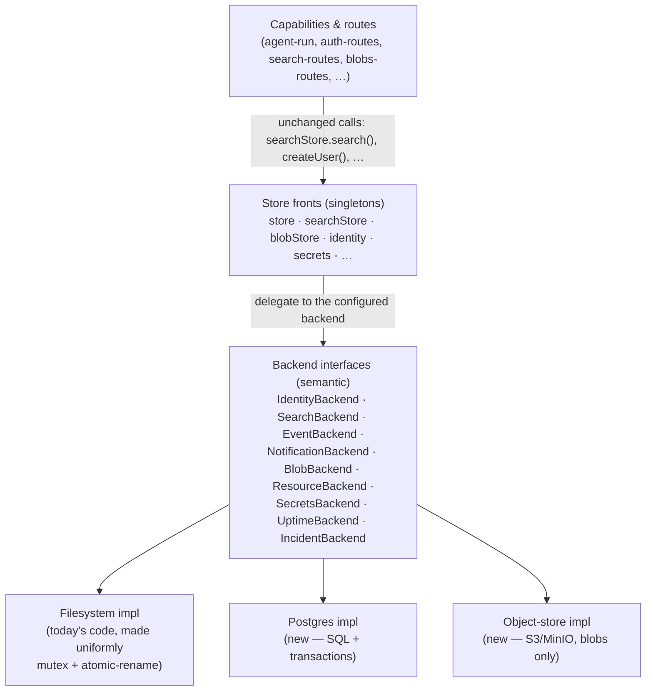
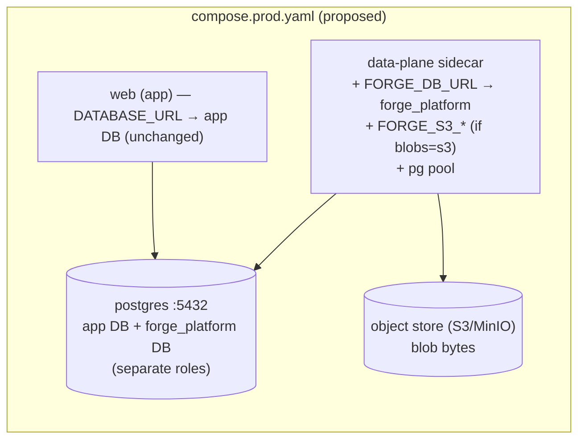
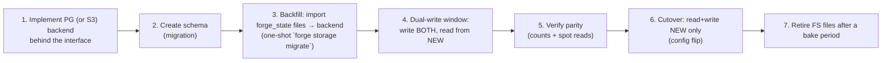

# 8 · Storage strategy — PROPOSAL (design only)

> **STATUS: PROPOSAL for the systems-design review. Design only — no capability or store code is changed
> by this document.** It specifies where Forge's platform storage should go before the first
> production-ambition consumer builds on it, and how to get there without changing a single capability
> **contract**. Cross-references the shipped reality in [07 · Data storage](07-data-storage.md).

## 1 · The problem

[07 · Data storage](07-data-storage.md) documents the truth: **all** Forge platform state is node-local
flat files on the sidecar's `forge_state` volume. That is fine for a single-box demo and wrong for a
production-ambition app for three concrete reasons:

- **Single point of failure + no horizontal scale.** The state lives on **one** sidecar's local
  filesystem. You cannot run a second sidecar replica for the same app — the replicas would each hold a
  divergent copy of `auth/<appId>.json`, `search/<appId>.json`, etc. Identity, sessions, notifications,
  search, and blobs are therefore pinned to one node; if it dies, they are unavailable, and nothing scales
  out.
- **C19 search does not scale.** Every `/search` reads the whole per-app JSON document file and recomputes
  BM25 **in memory over the entire owner slice, per query** ([07 §2](07-data-storage.md)). Query cost is
  O(documents-per-owner) with the whole slice resident in memory — acceptable at small counts, a wall as
  a user's corpus grows.
- **Two stores are unsafe under concurrency (P27).** The C5 secrets vault and the generic Resource store
  are unguarded read-modify-write / plain overwrite ([07 §5](07-data-storage.md)) — the lost-update / torn-
  write class the engine stores already fixed with a mutex + atomic rename.

**Highest-priority targets (human directive): identity (C10) and search (C19) first.**

## 2 · The one invariant: capability contracts do not change

Every HTTP endpoint, request/response shape, error code, owner-scoping rule, and CLI stays **byte-for-byte
the same**. This work swaps **backends**, never contracts. A consumer app cannot tell which backend is
running — that is the whole point, and it is what makes the migration safe to do incrementally.

## 3 · The real pluggable store-backend seam

### Where the seam is today, and why it's not enough

Capabilities already depend only on a **store object's methods** — `store.saveResource(...)`,
`searchStore.search(...)`, `createUser(...)` — never on `node:fs` directly. Good hygiene. But each store is
a **single concrete class that hardcodes the filesystem**; there is no interface with alternate
implementations ([07 §3](07-data-storage.md)). So the swap is impossible without editing every store class.

### The design: a semantic backend interface per store domain, selected by config

Introduce, **per store domain**, a backend interface defined at the **capability-semantic** level (not the
file level), with two or more implementations. The public "front" singleton the capabilities already
import (`store`, `searchStore`, `blobStore`, …) keeps its exact method surface and simply **delegates** to
the configured backend.

The seam must be **semantic** (e.g. `search(appId, query) → ranked hits`), not storage-primitive (e.g.
`readFile`), because that is what lets a SQL backend do the work natively (a Postgres FTS `search` runs an
indexed query + `ts_rank`; the filesystem `search` reads the map and runs the in-TS BM25 ranker) behind
the identical method.



**Interface sketch** (illustrative TypeScript — *not committed code*; the shape mirrors each store's
existing method surface so the front classes forward 1:1):

```ts
// One interface per domain. Each keeps the SEMANTIC operations the capability needs, so a SQL impl can
// satisfy them natively. Example — search:
export interface SearchBackend {
  index(appId: string, doc: SearchDocument): Promise<SearchDocument>;
  reindex(appId: string, docs: SearchDocument[]): Promise<number>;
  delete(appId: string, ref: { owner: string; type: string; id: string }): Promise<boolean>;
  search(appId: string, query: SearchQuery): Promise<SearchResponse>; // owner-scoped, ranked
}

// Example — identity (the atomic operations become transactions in the PG impl):
export interface IdentityBackend {
  createUser(appId: string, input: NewUser): Promise<StoredUser>;   // unique-email constraint
  findByEmail(appId: string, email: string): Promise<StoredUser | null>;
  createSession(appId: string, userId: string, ttl: number): Promise<StoredSession>;
  redeemRefreshToken(appId: string, presented: string, successor: string, opts: RotateOpts): Promise<RefreshRedeem>; // single-use rotation
  // …the full method set today's plugins/auth-identity/store.ts exposes
}

// Selected once, at the composition root, from config:
export function makeBackends(cfg: StoreConfig): Backends {
  const db = cfg.dbUrl ? new PgPool(cfg.dbUrl) : null;
  return {
    identity: cfg.identity === 'postgres' ? new PgIdentityBackend(db!) : new FsIdentityBackend(),
    search:   cfg.search   === 'postgres' ? new PgSearchBackend(db!)   : new FsSearchBackend(),
    blobs:    cfg.blobs    === 's3'       ? new S3BlobBackend(cfg.s3)   : new FsBlobBackend(),
    // …one per domain
  };
}
```

**Configuration.** A global default plus per-domain overrides, read at boot:

```
FORGE_STORE_BACKEND = filesystem | postgres        # global default (default: filesystem)
FORGE_IDENTITY_BACKEND, FORGE_SEARCH_BACKEND, …     # per-domain override
FORGE_DB_URL       = postgres://…                   # the platform datastore (see §6)
FORGE_BLOB_BACKEND = filesystem | s3
FORGE_S3_ENDPOINT / _BUCKET / _REGION / _KEY / _SECRET
```

**How a capability binds to a backend: it doesn't — nothing in a capability changes.** The composition
root (`src/data-plane/server.ts` and `src/api/server.ts`) calls `makeBackends(config)` at boot and injects
the result into the store fronts. Capabilities keep importing `searchStore` / `store` and calling the same
methods. **The only files that change are the store internals + the boot wiring — never a capability or a
route.** That is the contract-stability guarantee made mechanical.

## 4 · Per-capability backing-store recommendation

Analyzed by access pattern, write rate, consistency need, and the FS scale ceiling.

| Capability | State | Access pattern | Write rate | Consistency need | Recommended backend | Why |
|---|---|---|---|---|---|---|
| **C10** identity/sessions | users, sessions, refresh/verify/reset tokens | point lookups (email, session id, token hash); a session/token check per request | med (logins, refresh rotations) | **strong** — single-use refresh rotation is race-critical | **Postgres** | indexed point lookups; rotation becomes one `SELECT … FOR UPDATE`/`UPDATE … WHERE` transaction (cleaner + safer than the mutex today); shared across replicas |
| **C11 / C29** authz | ownership dimension (C11, shipped) + policy/role store (C29, [proposed](06-planned-capabilities.md)) | high-read policy/ownership eval; low writes | low writes | strong-ish | **Postgres** | roles/memberships/policies are relational; the enforcement point wants indexed transactional reads; co-locate with identity |
| **C3** events | append-only domain log + indexed queries (by owner, by subject, latest-per-subject) | append + filtered range reads | **high** (every app mutation may emit) | append durability; read-your-writes | **Postgres** | `INSERT` append + B-tree indexes on `(app_id, owner, at desc)` and `(app_id, subject)`; “latest per subject” = indexed `DISTINCT ON` — no whole-file scan |
| **C4** notifications | keyed upsert map | upsert by `(owner,key)`; list by owner | low–med | strong (dismiss/clear) | **Postgres** | `INSERT … ON CONFLICT` upsert; PK `(app_id, owner, key)`; indexed list; no whole-map rewrite |
| **C15** incidents | keyed incidents | create/update/resolve/list | very low | strong-ish | **Postgres** | trivial table; wants shared state across replicas; near-zero cost |
| **C15** uptime | health snapshots + per-day rollups | append sample + windowed read | med (sampler tick) | eventual OK | **Postgres** (time-series table) *or defer to FS* | low business value; if single-replica is acceptable short-term it can stay FS longest — see below |
| **C19** search | document index | full-text query with owner+type+date filters; upsert on write | med writes, med reads | eventual (best-effort writes) | **Postgres FTS (tsvector + GIN)** now; dedicated engine later only if needed | GIN index → sub-linear query vs today's O(n) in-memory scan; reuse Postgres, no new infra; owner-scope = `WHERE owner=` — see §5 |
| **C20** blob bytes | opaque binary objects | write-once, streamed reads (HTTP Range) | low–med | strong (content-addressed) | **Object store (S3/MinIO)**; metadata → Postgres | durable, shared, scales past a node volume; native ranged/streamed reads; presign/stream; metadata table gives owner-scope + quota without a rewrite |
| **C5** secrets | sealed KV | `set`/`unset`, `read-all` at boot & per resolve | very low | strong | **Postgres (sealed rows)** or an external manager (Vault/cloud KMS); interim: **guarded FS** | fix P27 with a transactional row upsert while **keeping AES-256-GCM seal at rest**; a managed KMS is the long-term ideal |
| **Resource store** (C1/C2/C7/C12/C14 + core) | generic JSON resources | get by type/id; list by type/app/owner | med | write-once mostly; C2 `ScheduledJob` is mutable | **Postgres (`jsonb`)** | one `resources` table with a `jsonb` doc + indexes on `(type, app_id, owner)`; transactional updates fix P27; indexed list replaces `readdir`+parse-all |
| **C16** theme | one JSON file, mounted read-only | read on render | ~none (deploy-time only) | n/a | **Filesystem (mounted) — stays** | it is a build/deploy config artifact, immutable per deploy, never written at runtime; a DB adds nothing |

### What legitimately stays filesystem

- **C16 theme** — a mounted, read-only, deploy-time config artifact. No runtime writes, no query, no
  sharing problem. Keep it a file.
- **C15 uptime (optionally, shortest-lived exception)** — low value and naturally per-node observational
  data; it can remain FS the longest while identity/search/events move. Move it only when running multiple
  sidecar replicas makes per-node uptime files incoherent.
- Everything **security-critical or shared-state (C10, C11/C29, C3, C4, C19, C20, C5, resources) moves.**

## 5 · Search (C19) — the recommendation and the tradeoff

The reviewer expects a Solr/ES/Redis-class engine; there is none, and that is a deliberate call to
re-make, not just inherit. The consumer app does its **own semantic reasoning** and needs the platform to
provide **solid keyword + filter recall**, owner-scoped — not best-in-class relevance.

| Option | Pros | Cons |
|---|---|---|
| **Postgres FTS** (`tsvector` + GIN, `websearch_to_tsquery`, `ts_rank`) | Reuses the Postgres we're already adding — **no new infra/ops**; GIN index → sub-linear queries; owner/type/date filters are plain `WHERE`; transactional with the rest of platform state; `pg_trgm` adds typo/prefix tolerance later; can add `pgvector` for hybrid search without new infra | Relevance is good keyword recall, not tuned like a search engine; field weighting/faceting is more manual; very large corpora eventually favor a dedicated engine |
| **Dedicated engine** (Typesense / Meilisearch / OpenSearch) | Best relevance, typo tolerance, faceting, horizontal scale; purpose-built | **New service to run, secure, back up, and keep in sync**; another network dependency in the sidecar path; overkill when the consumer supplies its own semantics |

**Recommendation: Postgres full-text search (tsvector + GIN).** Rationale: it eliminates the O(n)
in-memory scan (the actual defect) with a real inverted index, adds **zero** new infrastructure on top of
the Postgres we already introduce for identity/events, keeps owner-scoping as a trivial `WHERE owner =`,
and is more than enough for keyword+filter recall when the consumer owns the semantic layer. Schema sketch:

```sql
CREATE TABLE search_docs (
  app_id text, owner text, type text, id text,
  title text, body text, tags text[], attrs jsonb,
  created_at timestamptz, updated_at timestamptz,
  tsv tsvector GENERATED ALWAYS AS (
    setweight(to_tsvector('simple', coalesce(title,'')), 'A') ||
    setweight(to_tsvector('simple', array_to_string(coalesce(tags,'{}'),' ')), 'B') ||
    setweight(to_tsvector('simple', coalesce(body,'')), 'C')
  ) STORED,
  PRIMARY KEY (app_id, owner, type, id)
);
CREATE INDEX ON search_docs USING GIN (tsv);
CREATE INDEX ON search_docs (app_id, owner);
-- query: WHERE app_id=$1 AND owner=$2 AND tsv @@ websearch_to_tsquery('simple',$3) ORDER BY ts_rank(tsv,q)
```

Note the generated `setweight` A/B/C preserves today's title>tags>body weighting. **What would change the
recommendation to a dedicated engine:** a product need for typo-tolerant/fuzzy relevance beyond `pg_trgm`,
rich faceting/aggregations, cross-tenant search at large scale, or **hybrid semantic+keyword** ranking
that outgrows `pgvector`. Until one of those is real, Postgres FTS is the right, low-ops choice.

## 6 · Making the data-plane sidecar datastore-aware

Today the sidecar has **no DB connection** — `DATABASE_URL` is injected into `web` only ([07 §4](07-data-storage.md)); the sidecar's env is `FORGE_*` + declared secrets. Postgres-backed capabilities require a connection.

### The change

- **Inject a platform DB URL into the sidecar:** a new `FORGE_DB_URL` (distinct from the app's
  `DATABASE_URL`). When a Postgres backend is selected and `FORGE_DB_URL` is absent, the sidecar fails
  fast at boot with a clear message (same "detectable absence" discipline the capabilities already use).
- **Connection pooling:** the sidecar opens a small `pg` **connection pool** (e.g. `max` 4–8 — it is
  **single-app** and low-concurrency, so the pool is modest), reused across requests. Health-gate the pool
  at boot so `/health` reflects DB reachability.
- **Object store:** when `FORGE_BLOB_BACKEND=s3`, inject `FORGE_S3_*`; the blob backend uses a streaming
  S3 client, preserving the Range/ETag/immutable-cache semantics the C20 routes already emit.

### Shared app DB vs. a dedicated platform DB — recommendation

**Recommend: a separate logical database + its own role on (by default) the same Postgres instance — not
the app's database.** Reasons:

- **Isolation & blast radius.** A platform bug can't corrupt app tables, and vice versa; migrations are
  owned separately.
- **Least privilege.** The sidecar's role touches only `forge_platform`; it never gets the app's DB
  grants.
- **The app may have no DB at all.** Platform storage can't depend on the app having provisioned Postgres.
  So when a Postgres backend is selected and the app didn't provision a DB, `forge provision` stands up a
  minimal Postgres for **platform** state.
- **Independent scale-out.** Start co-located (same instance, separate DB `forge_platform` + role) to
  avoid a second container; the connection string is the only thing that changes to move platform state to
  a **dedicated/managed** instance later.

### Interaction with `forge provision` + prod compose

- `forge provision` gains a **platform-datastore** notion: `--platform-store postgres` (or implied by the
  selected backends). It records that platform state needs Postgres, independent of the app's own
  `--infra postgres`.
- `forge productionize` then:
  - ensures a `postgres` service exists (reused if the app already has one **but with a distinct
    `forge_platform` DB + role**, or a dedicated `forge-postgres` service if preferred),
  - injects `FORGE_DB_URL=postgres://forge_platform:…@postgres:5432/forge_platform` into the **data-plane**
    service and adds a `depends_on: postgres (service_healthy)`,
  - injects `FORGE_S3_*` when the blob backend is object-store,
  - keeps `forge_state` mounted (still home for whatever stays FS: C16 theme, secrets in the interim, and
    as the migration staging area).



## 7 · Folding in P27 (the unguarded stores)

The interface work is exactly where P27 gets fixed, in **both** backends:

- **Filesystem impls** are brought to one uniform discipline: the C5 secrets vault and the Resource store
  gain the **per-app async mutex + atomic temp+rename** the C4/C10/C15/C19/C20 stores already use, so the
  FS backend is safe even before anyone moves to Postgres.
- **Postgres impls** make P27 **structurally impossible**: a read-modify-write becomes a single
  transaction (`INSERT … ON CONFLICT`, `UPDATE … WHERE`, `SELECT … FOR UPDATE`), so lost updates and torn
  writes can't occur regardless of concurrency.

Net: P27 is closed on the FS path immediately as part of the refactor, and moot on the PG path by
construction. (This also cleans up the minor space-vs-NUL key-separator inconsistency noted in
[07 §5](07-data-storage.md) — Postgres keys are real columns.)

## 8 · Migration & sequencing

**Order (identity + search first, per directive), then by risk/leverage:**

1. **C10 identity** — highest value; strong-consistency payoff (transactional rotation).
2. **C19 search** — highest performance payoff (kills the O(n) scan).
3. **C3 events** — highest write volume; biggest read-scan win.
4. **C4 notifications**, **C15 incidents** — small, mechanical.
5. **C20 blob bytes → object store** (metadata → Postgres with the resource move).
6. **C5 secrets** + **Resource store** — P27 stores; FS-guard first (fast), Postgres when convenient.
7. **C15 uptime** — last / optional.

**Per-store migration pattern (contract stable throughout):**



- **Backfill** reads the existing per-app JSON/JSONL files (their shapes are documented in
  [07 §1](07-data-storage.md)) and inserts them into the new backend — a bounded, resumable importer. The
  C11 `claim-legacy` owner-migration is prior art that the team already understands this pattern.
- **Dual-write** (write FS **and** the new backend, read from the new) de-risks each store: if the new
  backend misbehaves, flip the read back to FS with no data loss. Retire the dual-write + FS files only
  after a bake period.
- **Rollback** at any step before cutover is a config flip (`FORGE_<DOMAIN>_BACKEND=filesystem`), because
  FS is still being written during dual-write.
- **No endpoint, payload, error, or owner-scoping semantics change at any step** — verified by re-running
  the existing store/route tests against each backend (the same suite must pass for FS and Postgres).

## 9 · What this does NOT solve (honest limits)

Moving state off the node is necessary but not sufficient for true horizontal scale. Remaining single-node
assumptions and new costs:

- **The sidecar is still one instance per app.** Externalizing state makes the sidecar **stateless** —
  which is the *enabler* for N replicas — but actually running multiple sidecars is a **follow-on**, not
  delivered here. Until then the sidecar remains a SPOF for the platform-served surfaces (`/auth`,
  `/status`, the scheduler).
- **The C2 scheduler needs a single-runner guarantee once stateless.** Two sidecar replicas would each
  tick and double-fire jobs. Going multi-replica requires leader election or a Postgres advisory lock /
  `SELECT … FOR UPDATE SKIP LOCKED` claim on due jobs — a new mechanism to add when replicas arrive.
- **Long-lived connections still pin to a node.** The proposed remote-MCP SSE surface
  ([06 · A](06-planned-capabilities.md)) and any streaming path hold a connection to one replica; that
  needs sticky routing or a shared pub/sub, independent of where durable state lives.
- **Postgres becomes the new dependency to make HA.** We trade node-local files for a database SPOF —
  but that is a *well-understood, horizontally-addressable* dependency (managed/replicated Postgres,
  PgBouncer) rather than un-shareable local files. Call it out; don't pretend it's free.
- **Object store adds latency/egress** to blob reads vs. local disk, and the streamed-Range path must be
  preserved exactly.
- **This adds no new capability and changes no contract** — a feature, not a gap: it is invisible to
  consumers by design. But it is infrastructure hardening, not new product surface.

**Bottom line:** define the semantic backend interface, move **identity and search to Postgres first**
(with events close behind), put **blob bytes on an object store**, keep **theme on the filesystem**, fix
**P27** in the same pass, and migrate per store via backfill → dual-write → cutover — all under unchanged
capability contracts. That removes the filesystem SPOF for the security- and scale-critical surfaces and
makes the sidecar stateless, which is the precondition for everything horizontal that comes later.
