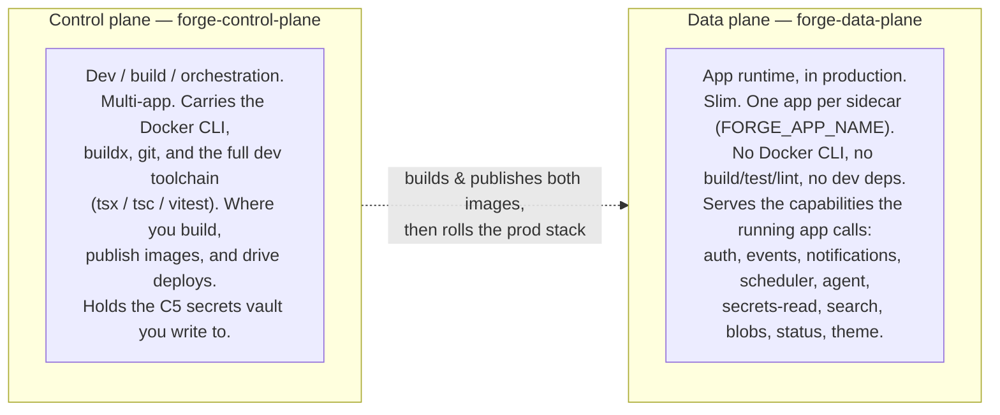

# Forge platform architecture (systems-design reference)

> **Authoritative, product-agnostic architecture of the Forge platform as it ships today.**
> This describes what Forge *is* for **any** consumer app — never a specific app's internals.
> Throughout, "the app" / "a consumer app" means whatever web application is consuming the
> platform; Forge is agnostic to what that app does.

Forge is an AI-native software-creation platform. A consumer app is a **black box** that Forge acts
*on* (at build time) and *hosts capabilities for* (at runtime). The app imports **no** Forge package;
it reaches the platform only through **injected env, HTTP endpoints, a same-origin proxy, and generated
config**. That boundary is the whole design.

## Read in this order

| # | Doc | What it answers |
|---|---|---|
| 1 | [Container strategy](01-container-strategy.md) | The two platform images (control-plane vs data-plane), the app's own runtime image, and the **production sidecar** model. Why dev/build deps never reach prod. |
| 2 | [Runtime topology](02-runtime-topology.md) | The deployed system: app container, data-plane sidecar, Postgres/Redis, durable volumes, Traefik ingress/TLS, and what the control plane does during a deploy. |
| 3 | [Call paths](03-call-paths.md) | Exactly how a deployed app reaches each capability at runtime — sequence diagrams for the event log, scheduler, model/agent, secret injection, search, blob, and auth/session flows. |
| 4 | [Capability catalog](04-capability-catalog.md) | Every shipped capability, which **plane** it lives in, and the concrete consumption mechanism (env var / injected config / HTTP endpoint / CLI). |
| 5 | [Adoption model](05-adoption-model.md) | How a consumer app *adopts* a capability: image pins, `provision` flags, injected config/env, client-side patterns, and the reference modules the app mirrors. |
| 6 | [Planned capabilities](06-planned-capabilities.md) | **PROPOSED, not yet built.** Where remote-MCP hosting + OAuth, an outbound-connector vault, inbound email, webhooks, mobile push, a policy engine, multi-member identity, and an eval harness plug into the architecture. |
| 7 | [Data storage](07-data-storage.md) | The concrete, per-capability backing stores (no "state blob"): exact on-disk layout on `forge_state`, what C19 search actually is (in-TS BM25, not a search engine), the store-interface + Postgres/S3 swap status, what really uses Postgres/Redis, and per-store atomicity/concurrency/durability. |

## The one idea behind everything: two planes

Forge ships as **two images** with a hard split. Every capability declares which plane(s) it runs in.

- **Rule of thumb.** If only a *build* or a `forge` command breaks without it, it is **control-plane**.
  If the *running production app* breaks without it, it is **data-plane**.
- **The mechanism.** A capability sets `plane: 'control' | 'data' | 'both'`. The data-plane HTTP server
  refuses any capability whose plane is `control`; the control-plane serves everything. Route-registered
  capabilities (auth, events, notifications, search, blobs, status, theme) are mounted on **both** servers
  from one source, so a capability behaves identically in dev (against the control plane) and in prod
  (against the sidecar).

## The cardinal boundary

The consumer app never imports Forge. It depends only on:

1. **Injected env** — e.g. `FORGE_EVENTS_URL` (the data-plane base URL), `AUTH_SESSION_SECRET`,
   `FORGE_SECRETS_KEY`, declared secrets.
2. **HTTP endpoints** the data-plane serves — `/app-events`, `/notifications`, `/search`, `/blobs`,
   `/auth/*`, `/status`, `/theme.css`, `POST /capabilities/agent-run`, `POST /capabilities/send-email`.
3. **A same-origin rewrite** — Next.js `rewrites()` proxies `/auth/*` to the sidecar so the session
   cookie is set on the app's own domain.
4. **Generated config** — the production `Dockerfile`, `compose.prod.yaml`, `.env.prod.example`, and a
   per-app provisioning runbook, all emitted by `forge productionize`.
5. **Reference modules the app mirrors** (never imports) — the session token/cookie contract and the
   health schema. The platform owns the definition; the app copies the small verifier locally so it can
   gate every request with no per-request round-trip.

Everything else in these docs is the detail of those five surfaces.
