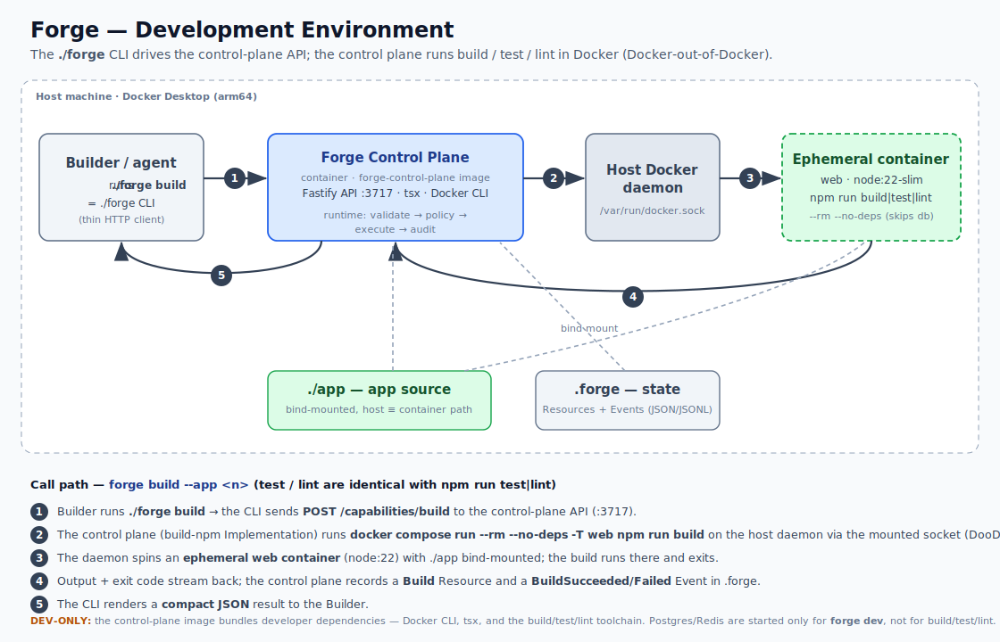
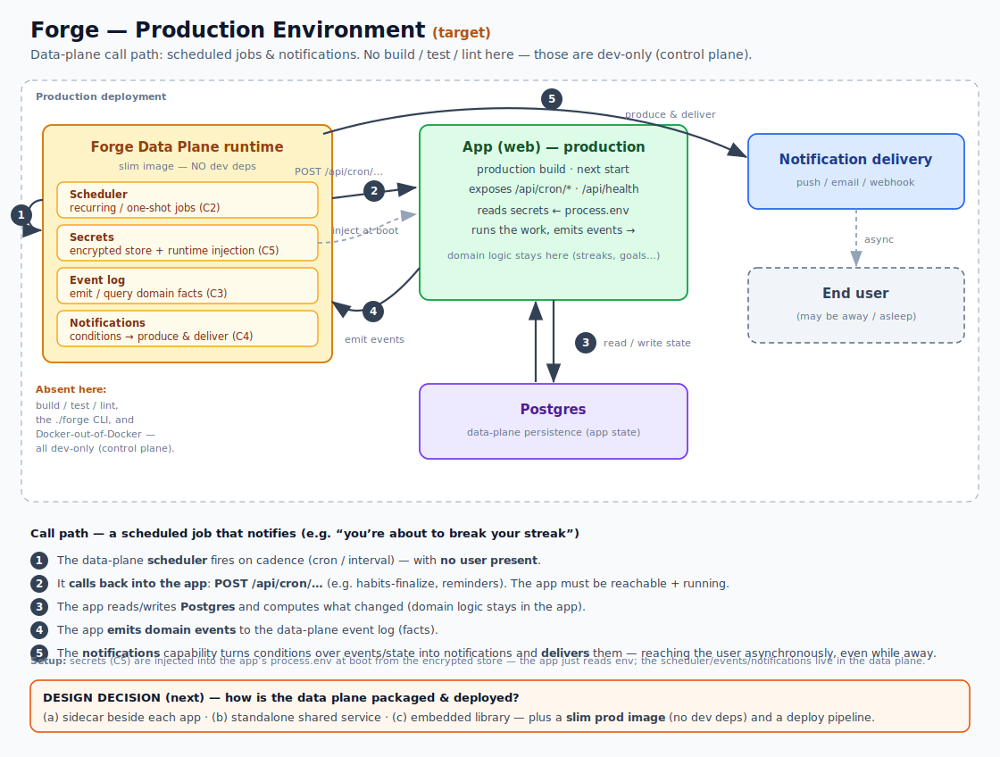

# Forge — environment & call-path diagrams

Two views of how Forge runs, and the **control-plane vs data-plane** split behind
[`PLATFORM_CAPABILITIES.md`](../../../forge-os/PLATFORM_CAPABILITIES.md)'s R3.

## Development environment

At dev time the **`./forge` CLI** (a thin HTTP client used by the Builder/agent) drives the
**Forge control plane** — a long-running container exposing an API on `:3717`. On `build`/`test`/`lint`
the control plane runs the work in **ephemeral app containers** via the host Docker daemon
(Docker-out-of-Docker); `./app` is bind-mounted at an identical host≡container path and Resource/Event
state lives in `.forge`.

The app is a **black-box consumer** — it does not embed a "Forge client". Forge acts *on* the app.

## Production environment (target)

In production the dev capabilities (build/test/lint, the `./forge` CLI, Docker-out-of-Docker) are
**absent**. What the running app needs are the **data-plane** capabilities — scheduler (C2), secrets
(C5), event log (C3), notifications (C4) — provided by a **slim data-plane runtime** that carries no
developer dependencies. It **calls into** the app (`POST /api/cron/…`), **injects** secrets into the
app's `process.env` at boot, and **produces/delivers** notifications while no user is present. Domain
logic stays in the app.

## The split (R3)

| | Control plane | Data plane |
|---|---|---|
| **Image** | `forge-control-plane` (today's `FORGE_IMAGE`) — bundles Docker CLI, tsx, build/test/lint | *TBD* — slim, no dev deps |
| **When** | dev / build / orchestration | app runtime, in production |
| **Examples** | `build`, `test`, `lint`, `provision` command, the `./forge` CLI | scheduler (C2), secrets injection (C5), events (C3), notifications (C4) |
| **Rule of thumb** | only a build or a `./forge` command breaks without it | the **production app** breaks without it |

> Today **everything runs on the control-plane image** — the C2 scheduler even ticks inside it. That's
> the v1 seam: when the data-plane image ships, the data-plane capabilities move to it unchanged.

## Open design decision (next)

1. **Packaging of the data plane:** (a) sidecar container beside each app · (b) standalone shared
   service · (c) embedded library.
2. **A slim production image** built without dev dependencies (no Docker CLI / tsx / test / lint) —
   e.g. a multi-stage Dockerfile splitting the data plane out of the control plane.
3. **A deployment pipeline** to build and publish that image.

## Editing

The diagrams are hand-authored **SVG** (scalable, diff-able). To preview locally:
`qlmanage -t -s 1400 -o /tmp <file>.svg` (renders a PNG), or open the SVG in a browser.
